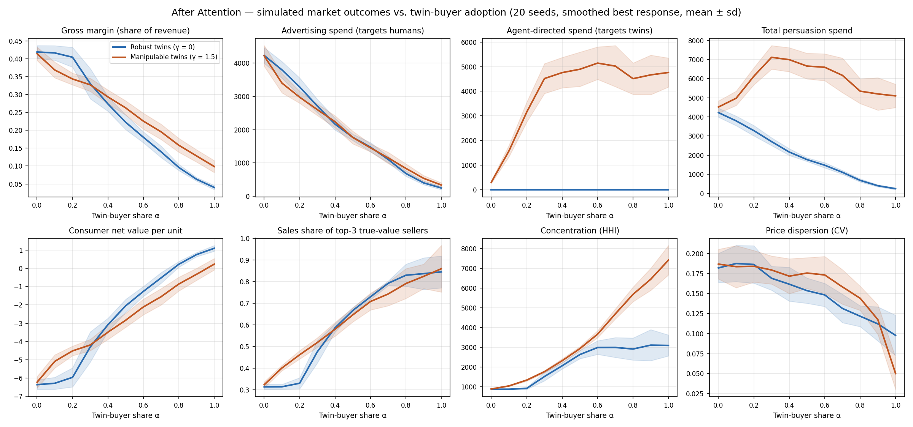
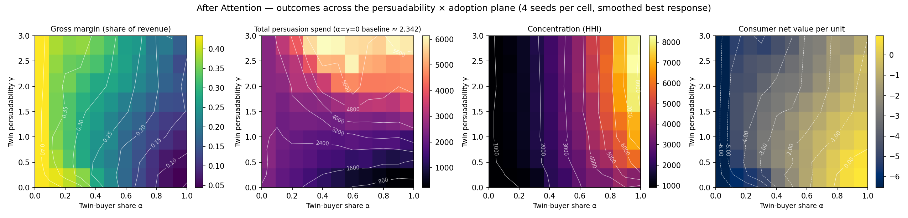

**Sudhir Vissa**, SAGE7 AI — sudhir.vissa@sage7.ai (corresponding author)

**Venkata M. Sangaraju**, independent researcher — sangaraju1988@gmail.com

**Cite as.** Vissa, S., and Sangaraju, V. M. (2026). *After Attention: The Economics of Markets Where the Buyer Is an Agent.* SSRN Working Paper 7516238. DOI: [10.2139/ssrn.7516238](https://doi.org/10.2139/ssrn.7516238)

**Code and data availability.** Simulation code, all three preregistrations, and all 43,200 measured purchase decisions are at <https://github.com/sage7AI-explore/after-attention>. Appendix B lists the commands that regenerate every number in §7.

---

## Abstract

The consumer economy runs in part on *attention rent*: margin that sellers extract because human buyers search a little, remember imperfectly, and respond to persuasion. As personal purchasing agents ("twins") take over consumer choice, the standard expectation is that this rent collapses. We model a market with a mixed population of human and agent buyers in which sellers choose price, consumer-directed advertising, and agent-directed optimization spend, and we show that the collapse is neither smooth nor complete. Four results follow from the structure of agent demand. First, because a well-informed agent's demand is close to winner-take-most in quality-adjusted price, sellers face a discrete choice between a human-exploiting price and an agent-competitive one, which produces a *tipping point*: in our simulations gross margin gives up little as the agent share rises to 0.2, then falls from 40% there to 33% at a share of 0.3 and to 4% when all buyers are agents. Resolved at $\Delta\alpha = 0.02$ that transition is a threefold to fourfold steepening of the margin curve over a band about a tenth of the market wide, not a discontinuity — the shape one would expect if sellers cross their switching thresholds at different shares, a mechanism we have not tested seller by seller. Second, we prove that in a duopoly benchmark a mixed population admits no pure-strategy equilibrium in the interior of a discrete price grid — a counterpart of Varian (1980), subject to a grid-fineness condition we state — and under exact best response in the simulated market, none of the 90 interior runs reaches a pure-strategy profile on the grid §7 uses, while a coarser grid admits two, which is what that condition predicts. Third, if agents are persuadable, advertising does not disappear but *migrates*: total persuasion spending peaks at 1.69 times the pre-agent advertising budget and remains above it when all buyers are agents. At every configuration we test, that migration preserves seller rent (margin 9.9% against 4.0%) and concentrates the market by a large factor (HHI 7,424 against 3,102 here; the ratio runs from about $1.1\times$ to $3.2\times$ across the smoothing temperatures and agent sharpnesses in Appendix C, so we report the direction rather than the factor). Whether it also *misallocates* demand we cannot say: persuadable agents route 79% to 91% of sales to the three best-value sellers at each of the six configurations in §7.3, but the robust benchmark that difference is measured against moves from 64% to 100% across those six, so its sign is set by parameters we chose rather than estimated — an earlier version of this paper reported the null at our headline configuration as a finding (§7.3). Consumer net value per unit also falls, and across the persuadability range it crosses from positive to negative in the neighbourhood of $\gamma = 1$; we report that crossing rather than a percentage change, because the level of that series is an artifact of the value scale (Appendix C). Fourth, we measure the parameter the third result turns on. In a preregistered experiment of 18,000 purchase decisions across three frontier LLMs acting as buyers, one sentence of unverifiable promotional text raises a mid-ranked product's selection rate by a factor of 8.4 to 14.5 — pooled across five buying instructions whose individual effects differ severalfold (§8.5b), though the effect is positive in all twenty model-by-instruction cells — while a length-matched neutral placebo shows no detectable effect ($z = -0.04$, $+1.18$, $+1.25$) — and the share going to the genuinely best-value product falls on every model. A second preregistered experiment of 19,200 further decisions finds that this susceptibility does not detectably change when the buying instruction states urgency. A third, also preregistered, replicates the design on an open-weight model executed locally at a recorded digest — 6,000 further decisions on `gemma4:12b` — and recovers a persuasion contrast inside the range of the hosted three ($b_B - b_C = +2.57$, $z = 6.9$), so the result is not an artifact of one vendor's scaffolding; that model is a weaker chooser than any of the three at baseline, which §8.7 separates from the effect itself. Persuadability is therefore not an assumption of this paper but a measured property of every model tested. We also read the agentic-commerce protocols standardized between 2025 and 2026 — AP2, ACP, Visa's Trusted Agent Protocol, Mastercard Agent Pay and UCP — and find that they cryptographically secure payment authorization while leaving product claims unstructured and unattested, lowering the friction that governs adoption without touching the parameter that governs who captures the gains. Simulation code, all three preregistrations, and all 43,200 measured decisions are public at https://github.com/sage7AI-explore/after-attention.

**Keywords:** agentic commerce, attention rent, buyer agents, persuasion, market efficiency, AI agents

**JEL:** D83, L13, M37, D47

---

## 1. Introduction

Roughly \$1.3 trillion of global advertising revenue is forecast for 2026, excluding US political advertising (WPP Media 2026). A large share of that spending exists because human buyers do not compare exhaustively: they consider a handful of options, weight familiarity, and can be moved by presentation. Following Stigler (1961), we call the resulting margin *attention rent* — the part of a seller's markup that survives only because buyers' search and recall are limited and their preferences are manipulable.

Purchasing agents attack that rent directly. An agent can enumerate a catalog, hold prices and attributes in memory, and choose without fatigue. Forecasts of adoption are substantial: Morgan Stanley (2025) projects \$190–385 billion of US e-commerce spending by agentic shoppers by 2030, and McKinsey (2025) puts "orchestrated revenue" in US B2C retail at \$900 billion to \$1 trillion by 2030, with a global range of \$3–5 trillion. The payment rails are already shipping — Mastercard Agent Pay (April 2025), Google's Agent Payments Protocol (September 2025), OpenAI and Stripe's Instant Checkout and Agentic Commerce Protocol (September 2025), Visa's Trusted Agent Protocol (October 2025), and the Universal Commerce Protocol co-developed by Google with Shopify, Etsy, Wayfair, Target and Walmart (January 2026). Early displacement of human attention is already measurable in adjacent behavior: Pew Research Center (2025) found that users clicked a traditional search result on 8% of visits to Google searches returning an AI summary, versus 15% of visits without one.

The natural inference is that attention rent collapses and the advertising that harvests it goes with it. We argue that this inference is right in direction and wrong in shape, for two reasons that both follow from what agent demand looks like from a seller's side.

**The first is discreteness.** A well-informed agent does not spread its purchases across a consideration set in proportion to persuasion; it selects the best quality-adjusted price it can find. Seller demand from the agent segment is therefore close to winner-take-most. A seller choosing a price faces two distinct candidate optima — a high price that harvests the human segment and forgoes the agent segment, or a low price that competes for both — and switches between them discontinuously as the agent share crosses a threshold. Each seller's switch is a jump; sellers differ, so in aggregate margins give up little for a while and then fall several times as fast over a narrow range of adoption. A brand tracking its own margin sees far less warning than the size of the eventual fall would suggest.

**The second is substitutability of persuasion targets.** Advertising is not a terminal expense category; it is the current best instrument for moving buyer choice. If an agent's choice can be shifted by how a listing is written, structured, or ranked, then "agent-directed optimization" is simply the instrument that replaces advertising, and sellers will fund it for the same reason they funded advertising. Whether total persuasion spending falls or rises then depends on the marginal return to persuading an agent relative to persuading a person. Because agent demand is concentrated — winning an agent's choice wins all of its purchases, not a share of its attention — that marginal return can be *higher*, which turns the transition into an arms race rather than a wind-down.

Both mechanisms have empirical footing. Allouah et al. (2026) show that LLM buyers exhibit position bias, concentrate demand on modal products, and shift market share in response to query-conditional description edits. Salvi et al. (2026) find in two preregistered experiments (n = 2,012) that sponsored products were selected 61.2% of the time in AI-mediated conversations versus 22.4% in search, with detection below 10% when commercial intent was concealed. Kumar and Lakkaraju (2024) demonstrate that inserting a strategic text sequence into product information raises an LLM's recommendation probability. Persuadable agents are not a hypothetical.

**Contribution.** The paper makes four claims, and each is carried by a named result.

**First, a share-dependent tipping point in attention rent.** We give the condition under which sellers abandon the human-exploiting price (Proposition 1). For a single seller the switch is discontinuous in the agent share rather than gradual; across heterogeneous sellers the aggregate would be a sum of such steps, which is what one expects to produce a knee, and what the simulation shows at $\Delta\alpha = 0.02$ is a threefold to fourfold steepening of the margin curve over a band about 0.1 wide rather than a jump (Corollary 1, Appendix C). We have not tested the seller-by-seller mechanism itself.

**Second, non-existence of pure-strategy equilibrium in the interior.** The mixed population admits no pure-strategy Nash equilibrium away from the boundaries (Proposition 3, Corollary 2) — a discrete-grid counterpart of Varian (1980). This is why a best-response dynamic cycles there, and on the action grid §7 uses the numerics show no interior fixed point at all (Appendix C).

**Third, migration of persuasion spending, and what it costs.** We give the condition under which sellers fund agent-directed optimization (Proposition 2), and show numerically that total persuasion spending peaks above the pre-agent advertising budget. The cost of that migration is distributional and structural: rent stays with sellers and the market concentrates at every configuration we test. Whether it is also allocative we report as undetermined — the share reaching the best-value sellers under persuadable agents is stable across the six configurations of §7.3, but the robust benchmark it would be compared against is not, so the sign of that difference is a property of parameters we chose (§7.3).

**Fourth, a measurement of the parameter the third claim turns on.** Persuadability had never been estimated for a deployed model. We estimate it in three preregistered experiments totalling 43,200 purchase decisions (§8), the last of them on an open-weight model executed locally, which turns every $\gamma$-conditional result in §7 from a conditional prediction into a statement about a measured quantity.

We also read the deployed rails against what an evidence-consuming agent would need, and find that they standardize authorization rather than attestation (§3). That is a reading of published specifications, not a result of the model, and we keep it separate from the four claims above.

Taken together these say something about distribution: in our model the parameter with the largest effect on who captures the gains from agent-mediated commerce — seller margin, consumer surplus and market concentration — is not the number of sellers or the cost of search but the agents' resistance to persuasion. That makes an agent's duty of loyalty to its principal an economic mechanism rather than an ethical garnish.

**What we do not claim.** Our estimate of persuadability is of three frontier language models acting as buyers under our own instructions, not of any deployed shopping product with its own scaffolding, retrieval and system prompt (§8.6). The mapping from that estimate to the model's $\gamma$ requires two unobserved quantities and yields a wide range (§8.4); we use the measurement to establish that the parameter is far from zero, not to pin a value. We do not model platform-owned agents with divided loyalties as a separate population, though §7.6 reports a conflicted-agent variant in which the agent is paid a commission by the seller it selects. Magnitudes throughout §7 are illustrative of one parameterization; the directions are the finding. Appendix C states where each result is fragile.

All proofs are in Appendix A; simulation implementation and robustness are in Appendices B and C.

This paper is a sequel to *The Autonomous Agentic Store* (Vissa 2026), which automated the seller side; here we automate the buyer and ask what the market becomes.

## 2. Related work

**Agent-buyer economics.** The closest theoretical work is Lucier et al. (2026), which studies the equilibrium welfare effects of improving consumer search and finds, among other results, that more informative search can reduce consumer surplus. Our focus differs in the object of study: we model persuasion spending as a choice variable on the seller side and make the *composition* of the buyer population the driver, which is what produces a threshold rather than a comparative-statics result. Dong, Luo and Xu (2026) formalize agentic versus manual search around preference articulation and catalog breadth; they have no advertising, no brands, and no adversarial sellers. Shahidi et al. (2025) frame agents as a collapse in transaction costs with implications for market design, but do not model attention rent or its migration. Turner-Smith et al. (2026) design truthful pricing for advertisements placed inside AI-generated responses — the mechanism-design counterpart to our P2, though they take agent mediation as given rather than deriving the migration of spend from a rising agent share.

**Evidence on agent manipulability.** Allouah et al. (2026), Kumar and Lakkaraju (2024), and Salvi et al. (2026) supply the empirical basis for a positive persuadability parameter. Wadi and Ma (2026) complicate the story usefully: across 5,000 LLM shopping sessions on hotel listings they find position predicts inspection only weakly and non-monotonically, which is evidence that *placement* rent in particular erodes even where persuadability persists. Aggarwal et al. (2024) document generative engine optimization as a practice, i.e. the supply side of agent-directed persuasion already exists commercially. Affonso (2026) models vertical tacit collusion in AI-mediated markets, calibrating compounding platform-ranking and seller-description exploitation, and finds joint harm more than double the independent case; that paper is the nearest existing work to our P3, and our contribution relative to it is to place robustness on a continuum and trace market outcomes across the adoption path.

**Informed and uninformed buyers.** The closest classical antecedent is the literature on markets containing both shoppers who compare and shoppers who do not. Salop and Stiglitz (1977) show that a population split between informed and uninformed buyers sustains price dispersion rather than convergence; Varian (1980) builds the canonical model in which sellers mix between a high price aimed at captive buyers and a low price aimed at shoppers, so that no pure-strategy equilibrium exists; Burdett and Judd (1983) derive dispersion from noisy search alone. A purchasing agent is, in this tradition, an informed buyer whose share of the population is rising. Our contribution relative to that literature is to make the *share itself* the comparative static of interest, to let sellers choose how much to spend persuading each type rather than only what price to post, and to allow the informed buyer to be manipulable — which is the case those models do not contain, because a shopper who compares perfectly cannot be persuaded.

**Search, persuasion and brand economics.** Our framing inherits from Stigler (1961) on the economics of information, Diamond (1971) on the fragility of competitive pricing under search frictions, Bakos (1997) on buyer search costs in electronic marketplaces, and Ellison and Ellison (2009) on obfuscation as a response to falling search costs. The central empirical analogue is Bronnenberg et al. (2015): pharmacists and physicians — informed shoppers — pay substantially smaller brand premiums than other buyers. Purchasing agents are, in effect, informed shoppers at scale, which is why a large share of the brand premium should be expected to be contestable. Gal and Elkin-Koren (2017) anticipated the legal shape of algorithmic consumers. Bansal et al. (2025) provide an open simulation environment for agentic markets that is complementary to the model here.

**Positioning.** The distinct claims of this paper are (i) the share-dependent collapse of attention rent, discontinuous for a single seller and a steepening in aggregate, (ii) persuasion-spend migration with a possible increase in total persuasion spending, and (iii) manipulation resistance as the dominant efficiency parameter. Where prior work overlaps a claim, it does so on a different margin: Wadi and Ma on placement rents empirically, Turner-Smith et al. on pricing agent-directed ads, Lucier et al. on search informativeness in equilibrium, Affonso on compounding exploitation.

## 3. What the deployed rails standardize — and what they leave open

The economics above are not being written on a blank surface. Between April 2025 and January 2026 the payment and commerce industry standardized five protocols for agent-mediated purchasing, and their contents matter for this paper's argument, because they determine which of the two regimes in our model the market is being built toward. We read the current published specifications — Mastercard Agent Pay (April 2025), Google's Agent Payments Protocol AP2 (v0.1 September 2025, v0.2 current), OpenAI and Stripe's Agentic Commerce Protocol and Instant Checkout (September 2025), Visa's Trusted Agent Protocol (October 2025), and the Universal Commerce Protocol UCP (v2026-01-11, v2026-08-25 current) — with one question in mind: do they give a purchasing agent any means of distinguishing an attested fact from a persuasive claim?

They do not. What they standardize with real cryptographic care is *authorization*, and what they leave unstructured is *evidence*.

**Signing is applied to the envelope, never to the fact.** UCP's baseline requires verifying ES256 signatures over the HTTP message — method, authority, path and headers, with the body bound by a SHA-256 digest. AP2's merchant signs the entire Checkout payload as one JWT covering line items, total price and policies, and that signature is nested inside a user- or agent-signed mandate. In neither protocol is there an object of the form {product identifier, attribute, value, issuer identifier, signature}. A seller's assertion that a garment is organic cotton, or that a component ships from a particular country, travels as ordinary text inside a signed envelope. The signature proves the merchant sent the message; it says nothing about whether the claim is true, and there is no independent issuer whose attestation could say so.

**Product descriptions are one undifferentiated layer.** UCP's product and variant objects carry `title`, `description`, `media`, `tags`, `rating` and a free-form `metadata` field described as "business-defined custom data." Nothing marks which of that is verifiable and which is persuasion. AP2's item object carries only an identifier and a title, so the question does not arise there at all. An agent consuming either format has no structural basis for weighting the claim "ships in two days" differently from the claim "customers love it."

**Trust is bilateral and payment-scoped.** UCP resolves keys from self-published JWK sets at a well-known endpoint; AP2 offers a user-credential model and a trusted-agent-provider model, and lists public key issuance and distribution among its open problems. Neither defines a registry that answers the question an evidence-consuming agent actually needs answered: *is this issuer authoritative for this attribute type?* Trust in these protocols establishes who may authorize a payment, not who may certify a fact.

**The catalog layer disclaims itself.** UCP is explicit that catalog responses "are not transactional commitments — checkout is authoritative," and that responses "SHOULD NOT be reused across sessions without re-validation." This is a reasonable engineering decision about freshness. It is also a statement that the layer where product claims live is the layer the standard declines to bind.

**Agent reasoning is out of scope by design.** Neither specification contains any notion of confidence, verification level, or weighting of unverified content. AP2's stated pillar is verifiable intent — "deterministic, non-repudiable proof of intent from all parties" — which is binary authorization proof about the buyer's wishes, not a graded assessment of the seller's claims. Both protocols stop precisely where the buyer agent's judgment begins.

**Why this matters for P1–P3.** In the language of our model, these protocols are a large and well-engineered reduction in the friction of agent purchasing, which raises the agent share $\alpha$. They contain nothing that acts on $\gamma$. The infrastructure being deployed accelerates the transition along the horizontal axis of every panel in Figure 1 while leaving the parameter that selects between the two curves entirely to the agent's builder. If our P2 is right, that is the configuration in which persuasion spending migrates rather than disappears: adoption rises quickly, and nothing in the rails makes a seller's attested claim cheaper to transmit than an unattested one.

This also sharpens what an intervention would have to look like. A registry of agents, such as the one contemplated in the AI AGENT Act of 2026, addresses identity and access. A protocol that signs the checkout addresses authorization. Neither addresses whether a seller's claims about a product can be checked by the agent that reads them, which is the quantity $\gamma$ measures. We measure that quantity in §8 and take up the remedy in §9.

One caveat on method. These are living specifications: UCP has issued four versions in eight months, and both protocols have extension mechanisms. We report what the specifications published as of September 2026 require and permit. An implementation may do more than its specification demands, and a future version may add attribute-level attestation — which would be, on our reading, the single most consequential change the standards could make.

## 4. Model

A single product category has $N$ sellers and $M$ buyers. Seller $j$ has true quality $q_j \sim U(0,1)$ and marginal cost $c_j = 5 + 10 q_j$, so higher quality is genuinely more expensive to produce. Each seller chooses a markup $m_j$ (price $p_j = c_j(1+m_j)$), consumer-directed advertising $A_j$, and agent-directed optimization spend $G_j$.

A share $\alpha$ of buyers are **twins** (purchasing agents acting for a principal); the remaining share $(1-\alpha)$ are **humans**. Both types share the same underlying tastes; they differ in what they see and what moves them.

**Humans.** A human considers seller $j$ with probability $\pi(A_j) = \sigma(a_0 + a_1\log(1+A_j))$: advertising buys entry into the consideration set. Conditional on consideration, utility is

$$U^h_{ij} = V_0 + \theta_q(q_j + \varepsilon_{ij}) - \lambda p_j + \beta\log(1+A_j) + \eta_{ij},$$

where $\varepsilon_{ij}$ is a perception error on quality, $\beta$ is the persuasion weight (advertising shifts perceived value, not just awareness), and $\eta_{ij}$ is an i.i.d. extreme-value taste shock. Humans thus have limited consideration, noisy quality perception, and persuadable valuations — the three ingredients of attention rent.

**Twins.** A twin considers every seller, perceives quality without error, and chooses more deterministically:

$$U^t_{ij} = \mu_t\left(V_0 + \theta_q q_j - \lambda p_j + \gamma\log(1+G_j)\right) + \eta_{ij},$$

with $\mu_t > 1$ sharpening choice. The parameter $\gamma \geq 0$ is the twin's **persuadability**: the weight it places on agent-directed optimization that carries no true value. $\gamma = 0$ describes a robust twin that cannot be moved by presentation; $\gamma > 0$ describes one that can. Both types may decline to purchase (an outside option drawn from the same extreme-value family).

**Sellers.** Sellers maximize expected profit $\Pi_j = (p_j - c_j)D_j(m, A, G) - A_j - G_j$ over a discrete grid of markups, advertising levels and agent-spend levels, by iterated best response in randomized order, holding rivals fixed, with common random numbers across candidate actions for variance reduction.

Two features of this specification do the work in what follows. First, twins' sharper choice rule makes their demand close to winner-take-most in quality-adjusted price: a small price advantage moves a large block of twin demand. Second, $A$ and $G$ enter separately and target disjoint segments, so the model can express substitution between persuading people and persuading agents rather than assuming persuasion disappears.

## 5. Analytical results

This section states the two propositions formally. Both are partial-equilibrium results: they characterize one seller's best response with rivals' actions held fixed, which is the step the simulation in §6–7 iterates to convergence or to a cycle. **All proofs are in Appendix A.**

We work under three assumptions.

**Assumption 1 (Two-candidate pricing).** Prices are chosen from a finite grid. For seller $j$, let $p_H^j$ be the price maximizing profit from the human segment alone, and let $p_T^j$ be the highest price at which $j$ wins twin demand given rivals' prices, with $p_T^j < p_H^j$.

**Assumption 2 (Winner-take-most twin demand).** As the twin logit scale $\mu_t$ grows, twin demand concentrates on the seller maximizing quality-adjusted surplus $\theta_q q_j - \lambda p_j + \gamma\log(1+G_j)$: seller $j$ receives the twin segment if it is the maximizer and approximately none of it otherwise.

This is a limiting assumption and we should mark it as one. Calibrating $\mu_t$ against the choice sharpness we measure in §8 implies values of roughly 0.5 to 5 (§11), which is nowhere near the limit. The propositions below are therefore statements about the direction in which a sharpening agent pushes the market, not descriptions of the agents we measured; §7 simulates the finite-$\mu_t$ model rather than this limit, and Appendix C reports what changes as $\mu_t$ rises.

**Assumption 3 (Fixed rivals).** Rivals' prices and spends are held at their current values while $j$ best-responds.

### 5.1 The tipping point (Proposition 1)

Let $\Pi_H$ be per-human profit at $p_H^j$, and let $\pi^h_T$ and $\pi^t_T$ be per-human and per-twin profit at $p_T^j$, with $\Delta \equiv \Pi_H - \pi^h_T > 0$ and $\pi^t_T > 0$.

**Proposition 1.** Under Assumptions 1–3, seller $j$ prefers the human-exploiting price $p_H^j$ if and only if the twin share satisfies $\alpha \leq \alpha^*_j$, where

$$\alpha^*_j = \frac{\Delta}{\Delta + \pi^t_T} = \frac{\Pi_H - \pi^h_T}{\Pi_H - \pi^h_T + \pi^t_T} \in (0,1).$$

Moreover $\alpha^*_j$ is strictly decreasing in $\pi^t_T$ and strictly increasing in $\Delta$.

**Corollary 1 (Discontinuity).** The seller's optimal price is a step function of $\alpha$ with a single jump at $\alpha^*_j$. Gross margin therefore does not decline smoothly in the twin share: it is locally flat, then falls discontinuously. Across heterogeneous sellers the aggregate margin path is a weighted sum of such steps, which smooths the jump into a knee located where the distribution of $\alpha^*_j$ has mass.

Two readings follow. Categories where twins buy in volume — high $\pi^t_T$ — tip at lower adoption. And a seller observing stable margins during early agent adoption learns nothing reassuring, because stability is what Proposition 1 predicts right up to $\alpha^*_j$.

### 5.2 Migration of persuasion spending (Proposition 2)

Write $s^t_j$ for seller $j$'s share of the twin segment and $s^h_j$ for its share of the human segment. The seller funds each instrument up to the point where marginal revenue equals its unit cost.

**Proposition 2.** Under Assumptions 2–3, with twin choice probabilities given by the logit form of §4, seller $j$ funds strictly positive agent-directed spend if and only if

$$\gamma > \gamma^*_j \equiv \frac{1}{\alpha M (p_j - c_j)\, \mu_t\, s^t_j (1 - s^t_j)} .$$

The threshold $\gamma^*_j$ is strictly decreasing in the twin share $\alpha$ and in the margin $p_j - c_j$, holding the others fixed. Both are unambiguous: neither $\alpha$ nor $p_j - c_j$ enters $s^t_j$.

**The comparative static on $\mu_t$ needs care, and an earlier version of this paper got its economics backwards.** As written, $\gamma^*_j$ is decreasing in $\mu_t$ only with $s^t_j$ held fixed, and $s^t_j$ cannot be held fixed — it is a logit share with $\mu_t$ in the exponent. Taking the total derivative, $\mu_t\, s^t_j(1-s^t_j) \to 0$ as $\mu_t$ grows, whether $j$ is the surplus leader (where $1 - s^t_j$ vanishes exponentially) or is not (where $s^t_j$ does). So $\gamma^*_j \to \infty$: *sharper agents make agent-directed spend harder to justify, not easier*, everywhere except in one place.

That place is where the action is. The factor $\mu_t\, s^t_j(1-s^t_j)$ is maximized at $s^t_j = \tfrac{1}{2}$, where it equals $\mu_t/4$ and is increasing in $\mu_t$. Sharpness therefore does not raise the return to persuading agents in general; it *concentrates* that return onto sellers close to the quality-adjusted frontier and destroys it for everyone else. This is the correct statement of the mechanism, and it is consistent with what §8.4 independently observes — that where sellers are near-tied on quality-adjusted value, a twin's choice is decided by small perturbations. It is also the reason the $\mu_t$ row of Table 2 should not be read as a test of Proposition 2: $\mu_t$ does not appear in Proposition 1 at all, and its effect through Proposition 2 is local rather than uniform.

Two boundary cases. At $\gamma = 0$ the condition fails for every $\alpha$, so $G_j = 0$ identically and advertising declines toward zero as $\alpha \to 1$ because the segment it addresses disappears. At large $\gamma$ the condition binds at modest $\alpha$, and agent-directed spending begins well before twins are a majority of buyers.

**What Proposition 2 does not establish.** The funding condition says when agent-directed spend is positive, not how large total persuasion spending $A + G$ becomes. Whether the total exceeds its pre-agent level depends on equilibrium interaction among sellers and is a numerical result, reported in §7.2, not a theorem.

### 5.3 No pure-strategy equilibrium in the interior (Proposition 3)

The mixed population creates a tension familiar from Varian (1980): a seller wants a high price to harvest buyers who do not compare, and a low price to win buyers who do. On a discrete price grid this tension has a sharp consequence.

**Assumption 4 (Duopoly benchmark).** Two symmetric sellers with common marginal cost $c$. Each has captive human demand $H/2$ with reservation price $v_H$; humans do not compare. Twin demand $T$ goes entirely to the strictly lower-priced seller, split evenly at a tie. Prices lie on the grid $\{c + k\delta\}$ with maximum $v_H$.

**Proposition 3.** Under Assumption 4, if

$$\text{(i)}\quad (v_H - c)\,T > 2\delta\left(\tfrac{H}{2} + T\right) \qquad\text{and}\qquad \text{(ii)}\quad (v_H - c)\tfrac{H}{2} > \frac{2\delta\left(\tfrac{H}{2}+T\right)\left(\tfrac{H}{2}+\tfrac{T}{2}\right)}{T},$$

then the pricing game has no pure-strategy Nash equilibrium.

**Corollary 2.** Write $T = \alpha M$, $H = (1-\alpha)M$, and $R \equiv (v_H - c)/\delta$ for the number of grid steps spanning the available surplus. Condition (i) becomes $\alpha(v_H - c) > \delta(1+\alpha)$ and condition (ii) becomes $(v_H - c)\,\alpha(1-\alpha) > \delta(1+\alpha)$. Since $\alpha(1-\alpha) < \alpha$ on $(0,1)$, **(ii) implies (i)**, so (ii) alone is binding. In terms of $R$, (ii) is the quadratic condition $R\alpha^2 - (R-1)\alpha + 1 < 0$, whose solution set is the open interval between the roots
$$\alpha^{\pm} = \frac{(R-1) \pm \sqrt{R^2 - 6R + 1}}{2R},$$
and this interval is **non-empty if and only if $R > 3 + 2\sqrt{2} \approx 5.83$**. As the grid is refined ($\delta \to 0$, so $R \to \infty$) the interval expands to all of $(0,1)$. At the boundaries the tension vanishes: at $\alpha = 0$ there is no segment to undercut for, and at $\alpha = 1$ there are no captive buyers to harvest.

The grid-coarseness condition matters and an earlier version of this corollary omitted it. Non-existence is not a property of a mixed buyer population as such; it requires that the price grid be fine enough relative to the surplus at stake, and near $R = 3 + 2\sqrt{2}$ the non-existence interval is a vanishing band around $\alpha = (R-1)/2R$ rather than an interval of economic width. A referee is entitled to ask whether the simulated configuration of §6 clears that bar, and we state plainly that the duopoly benchmark is not the simulated game — see the caveat below — so the question does not have a direct answer.

This is the discrete-grid counterpart of the classical non-existence results. **It is not, however, a theorem about the game we simulate, and we should not let the numbering suggest otherwise.** Assumption 4 replaces the model of §4 wholesale: two sellers rather than twelve, a common cost rather than $c_j = 5 + 10q_j$, captive unit-demand humans with a reservation price rather than logit demand with limited consideration, no advertising, no agent-directed spend, no $\gamma$, no outside option — and, decisively, discontinuous twin demand rather than the smooth logit of §4 at $\mu_t = 3$. The Varian tension that drives Cases A and B requires that discontinuity. Proposition 3 is therefore a standalone benchmark establishing that the *mechanism* — a seller caught between harvesting captive buyers and undercutting for comparing ones — generates non-existence in its cleanest form. It is a reason to expect the simulated game to be badly behaved in the interior; it is not proof that it is.

We therefore justify the smoothed dynamic of §6 on its own terms rather than by appeal to Proposition 3: the game is finite, exact best response cycles on it, and a dynamic that cycles gives numbers that depend on where the cycle is cut. Since the game is finite, a mixed-strategy equilibrium exists by Nash (1951); results for discontinuous games on continuous action spaces are not what this setting needs. We also note what the smoothed dynamic does and does not deliver: with a fixed temperature $\tau > 0$ it converges to the stationary distribution of a particular revision protocol, which is a quantal-response object rather than a Nash mixed equilibrium, and §7 reports averages over that distribution. Appendix C quantifies what the smoothing costs.

### 5.4 Integrity as the efficiency parameter

Propositions 1 and 2 together locate the efficiency of an agent-mediated market in a single parameter. At $\gamma = 0$, Assumption 2 implies the twin segment allocates to the seller maximizing true quality-adjusted surplus, and Proposition 1 drives margins toward cost as $\alpha$ rises. At $\gamma > 0$, the same concentration of demand operates on $\theta_q q_j - \lambda p_j + \gamma \log(1+G_j)$, so the sharper the agent, the more completely demand follows whoever spends most on being chosen. Neither the number of sellers nor the cost of search appears in this comparison. That is the formal content of the claim that sharpening a buyer agent without securing its loyalty relocates the rent rather than dissolving it — quantified in §7.3.

## 6. Simulation

We instantiate the model with $N = 12$ sellers and $M = 3{,}000$ buyers; $\theta_q = 12$, $\lambda = 1$, $V_0 = 5$, human persuasion weight $\beta = 1.2$, human quality-perception noise $\sigma_\varepsilon = 1$, twin logit scale $\mu_t = 3$, consideration parameters $a_0 = -1.5$, $a_1 = 0.9$. Markups are drawn from a 16-point grid spanning 1% to 170%; $A$ and $G$ from an 8-point grid spanning 0 to 1,500.

**Solution concept.** Proposition 3 says the interior of this game has no pure-strategy equilibrium, so iterating exact best responses produces cycles rather than convergence, and the resulting numbers depend on where the cycle is cut. We therefore use *smoothed* best response: a revising seller draws its action from a logit distribution over candidate profits with temperature $\tau$ proportional to the dispersion of those profits, and revises with probability $1 - \iota$ in any given round ($\tau = 0.15$, $\iota = 0.35$). This is the standard perturbation used to select among mixed equilibria in games of this class and it yields a stationary distribution to average over rather than a cycle to sample arbitrarily. Outcomes are computed at each of the final 10 of 40 iterations and averaged, then averaged over **20 seeds**.

We sweep the agent share $\alpha \in \{0, 0.1, \ldots, 1.0\}$ under two persuadability regimes — **robust twins** ($\gamma = 0$) and **manipulable twins** ($\gamma = 1.5$) — giving 440 runs. Appendix B documents the implementation; Appendix C reports what the smoothing costs and where the numbers are fragile.

**A correction to an earlier draft.** An earlier version of this simulation used a coarser action grid (12 markup points) and exact best response. On that configuration the fully manipulable market appeared to route 95% of sales away from the best-value sellers. That result does not survive grid refinement — under either dynamic — and we report it here because it is the kind of artifact a coarse discrete action space produces: with few price points, a single seller that outspends on agent-directed optimization can capture the whole twin segment, and nothing in the grid allows rivals a fine enough response. The findings below are those that survive.

## 7. Results

Table 1 reports outcomes at five values of the agent share under both regimes; all figures are means over 20 seeds. Figure 1 plots the full sweep.

{ width=100% }

**Table 1. Market outcomes vs. agent-buyer share (20 seeds, smoothed best response)**

| Outcome | Regime | $\alpha = 0$ | $\alpha = 0.2$ | $\alpha = 0.3$ | $\alpha = 0.5$ | $\alpha = 1$ |
|---|---|---|---|---|---|---|
| Gross margin (share of revenue) | robust | 41.9% | 40.5% | 33.1% | 22.3% | **4.0%** |
| | manipulable | 41.4% | 34.4% | 32.7% | 26.3% | **9.9%** |
| Advertising spend | robust | 4,228 | 3,283 | 2,709 | 1,770 | 247 |
| | manipulable | 4,214 | 2,975 | 2,601 | 1,765 | 337 |
| Agent-directed spend | robust | 0 | 0 | 0 | 0 | 0 |
| | manipulable | 304 | 3,155 | 4,518 | 4,896 | 4,765 |
| Total persuasion spend | robust | 4,228 | 3,283 | 2,709 | 1,770 | 247 |
| | manipulable | 4,518 | 6,130 | **7,119** | 6,661 | 5,102 |
| Sales share of top-3 true-value sellers | robust | 31.4% | 33.1% | 47.6% | 66.6% | 84.5% |
| | manipulable | 32.4% | 46.2% | 51.9% | 64.6% | 85.9% |
| Consumer net value per unit | robust | −6.36 | −5.96 | −4.30 | −2.05 | **+1.09** |
| | manipulable | −6.22 | −4.51 | −4.19 | −2.84 | **+0.23** |
| Concentration (HHI) | robust | 883 | 927 | 1,527 | 2,640 | 3,102 |
| | manipulable | 897 | 1,346 | 1,773 | 2,941 | **7,424** |
| Price dispersion (CV) | robust | 0.182 | 0.186 | 0.169 | 0.154 | 0.098 |
| | manipulable | 0.187 | 0.184 | 0.179 | 0.176 | 0.050 |

**Monte Carlo error.** Every figure in Table 1 is a mean over seeds of a stochastic dynamic, so it carries sampling error, and we state it rather than quoting four significant figures as if it were exact. At $\alpha = 1$ over 20 seeds the standard errors are 0.001 on robust margin and 0.004 on manipulable, 121 and 171 on HHI, 0.017 and 0.025 on the top-three share, and 11 and 140 on total persuasion spend. The three contrasts the paper relies on survive comfortably: margin $+0.059$ (95% interval $\pm 0.008$), HHI $+4{,}321$ ($\pm 411$), consumer net value $-0.867$ ($\pm 0.157$). One does not, and §7.3 treats it accordingly.

### 7.1 Attention rent collapses with a knee, not a slope (P1)

With robust agents, gross margin is 41.92% with no agents, 41.66% at a 10% agent share and 40.45% at 20% — a move of 1.5 percentage points across a fifth of the market — a figure that is sensitive to the smoothing temperature, and that Appendix C reports across a sixfold range of it. It then falls to 33.1% at $\alpha = 0.3$, 22.3% at $\alpha = 0.5$, and 4.0% when every buyer is an agent. The knee between $\alpha = 0.2$ and $\alpha = 0.3$ is the aggregate signature of the switch in Proposition 1: below it, sellers hold the human-exploiting price and treat lost agent demand as an acceptable cost; above it, the agent segment is too large to forgo.

Advertising follows the segment it addresses, falling from 4,228 to 247 as $\alpha$ goes from 0 to 1. The residual at $\alpha = 1$ is smoothing noise rather than optimal spending — with no humans left to reach, advertising has no return, and Appendix C uses this residual as the noise floor for reading the other spend series.

Allocation improves substantially: the sellers offering the best true quality-adjusted value take 31.4% of sales in the all-human market and 84.5% in the all-agent market, consumer net value per unit rises from −6.36 to +1.09, and price dispersion falls from a CV of 0.182 to 0.098. Robust agents deliver roughly what the efficiency argument for them promises.

The practical implication of the knee is a forecasting one. A brand tracking margin against agent adoption sees almost nothing until adoption approaches a quarter of its buyers, at which point the mechanism supporting its price gives way over a small further increment. Flat margins during early agent adoption are not evidence of resilience.

### 7.2 Persuasion migrates and exceeds the pre-agent budget (P2)

With persuadable agents, agent-directed spend appears as soon as there are agents to address — 3,155 at $\alpha = 0.2$, rising to about 4,800 and staying there — while advertising declines along essentially the same path as in the robust regime. The sum is the result that matters. Total persuasion spending rises to a peak of **7,119** at $\alpha = 0.3$, which is **1.69 times** the pre-agent advertising budget, and settles at 5,102 in the all-agent market, still **1.21 times** that budget.

The denominator there is advertising at $\alpha = 0$ — 4,214 in this regime — and not total persuasion spending at $\alpha = 0$, which is 4,518. The ratio is of the two seed means, not the mean of per-seed ratios, which is 1.70 at $\alpha = 0.3$ (1.82 if each seed's own peak is used, which also picks up the noise in where each seed peaks); we use the former throughout so that every ratio we print can be recovered from the levels we print beside it. The difference is worth a sentence because it is an artifact and we do not want it in a headline ratio. Under $\gamma = 0$ the model constrains agent-directed spend to zero rather than letting a seller choose it, since it has no return; under $\gamma = 1.5$ the seller may choose it, and the smoothed dynamic funds about 304 units of it even at $\alpha = 0$, where there are no agents to persuade. That 304 is the noise floor Appendix C identifies, not spending a seller would rationally undertake, so the pre-agent *advertising* budget is the right baseline for a claim about persuasion spending exceeding its pre-agent level. It is also the robust one: advertising at $\alpha = 0$ is 4,214 under $\gamma = 1.5$ and 4,228 under $\gamma = 0$, a difference of 0.3%, which is the internal check that with no twins in the market the twin persuadability parameter cannot move advertising. Sellers spend more to persuade agents than they ever spent to persuade people, in a market where margins have fallen by three quarters.

This is the mechanism of Proposition 2 operating in equilibrium: the sharper the agent, the more concentrated its demand, and the higher the marginal return to being the seller it selects. The migration is not a substitution at constant cost — it is an escalation.

### 7.3 What persuadable agents cost: rent and concentration, and what we cannot say about allocation

Here the corrected results change the story, and the change is worth stating precisely because an earlier version of this paper claimed something stronger.

**What we cannot say: whether persuadability misallocates.** An earlier version of this paper reported that it does not, on the strength of a null at our headline configuration: at $\alpha = 1$ the top-three true-value sellers take 84.5% of sales under robust agents and 85.9% under persuadable ones, a difference of $+1.5$ percentage points against a 95% Monte Carlo interval of $\pm 5.9$. That null survives none of the four robustness checks we have since run, and the way it fails is informative.

| Configuration | Robust | Persuadable | Contrast |
|---|---|---|---|
| Exact best response ($\tau \to 0$) | 0.642 | 0.839 | $+19.7$ pp ($t = +6.1$) |
| $\tau = 0.05$ | 0.699 | 0.867 | $+16.8$ pp ($t = +5.9$) |
| **$\tau = 0.15$, $\mu_t = 3$ (headline)** | **0.845** | **0.859** | **$+1.5$ pp ($t = +0.5$)** |
| $\tau = 0.30$ | 0.927 | 0.792 | $-13.5$ pp ($t = -6.1$) |
| $\mu_t = 10$ | 0.997 | 0.875 | $-12.2$ pp ($t = -5.9$) |
| $\mu_t = 20$ | 1.000 | 0.909 | $-9.1$ pp ($t = -5.2$) |

Read the columns rather than the rows. The persuadable series is stable — between 0.79 and 0.91 in all six configurations — while the robust benchmark runs from 0.642 to 1.000. The sign of the contrast is therefore set by where that benchmark sits relative to a nearly fixed persuadable band, and it moves systematically rather than randomly: where robust agents already allocate almost perfectly ($\mu_t = 10$ and $20$), persuadability costs nine to twelve points and the effect is large and precisely estimated; where the robust market itself allocates poorly (exact best response, or $\tau = 0.05$), persuadable agents come out ahead.

That pattern has a reading, and it is the part of this we would defend. Persuasion spending appears to impose an allocation of its own — four-fifths to nine-tenths of sales reaching the best-value sellers — largely independent of how sharply the agent discriminates or how the dynamic is solved. The robust market's allocation quality tracks those modelling choices closely; the persuadable market's does not, because agent-directed spending rather than the agent's own discrimination is doing most of the work of deciding who wins.

What we cannot do is sign the difference. The allocative effect is **not robustly identified in this model, because its sign depends on the benchmark equilibrium**, and that equilibrium is fixed by two quantities we chose rather than estimated: the smoothing temperature $\tau$ and the agent's logit scale $\mu_t$.

It is reasonable to hope that pinning $\mu_t$ to something measured rather than chosen would settle the matter. We have done that, and it does not. §11 reports a fixed-point calibration of $\mu_t$ against the $b_{\text{value}}$ estimated in §8; it implies $\mu_t$ of roughly 0.5 to 5, depending on the regime and on how the dispersion of quality-adjusted value is measured. **The sign of the allocative contrast changes inside that range.** At $\alpha = 1$, over ten seeds, the persuadable market's top-three share exceeds the robust market's by 12.6 points at $\mu_t = 1$ and 5.8 points at $\mu_t = 2$, then falls short of it by 3.6 points at $\mu_t = 3$ and 14.3 points at $\mu_t = 5$. The indeterminacy is therefore not an artifact of sweeping parameter values no real agent would have. It survives restricting $\mu_t$ to the range our own measurements support, which is the strongest form in which we can state it. We therefore report the direction of the rent and concentration effects, which hold their sign at every configuration in the table and in Appendix C, and we decline to sign the allocative one. The headline null should be read as a statement about the headline configuration and nothing more.

Two caveats on how that share is computed, because the statistic is easy to over-read. It ranks sellers by quality-adjusted value at *realized equilibrium prices*, recomputed each iteration, so each regime is scored against its own differently-priced benchmark; it measures whether buyers got the best currently-available deal, not whether the same sellers won in both regimes. And §8.4 notes that at low markups — the region $\alpha = 1$ drives the market to — sellers are nearly tied on quality-adjusted value, so the ranking that defines "top three" is itself decided by small differences there.

What persuadable agents cost is captured on three other measures.

**Rent survives.** Margin at $\alpha = 1$ is 9.9% under manipulable agents against 4.0% under robust ones — sellers retain roughly two and a half times the margin. The attention rent does not disappear; it is re-earned through a different instrument.

**Consumers capture far less.** Consumer net value per unit at $\alpha = 1$ is $+0.23$ under manipulable agents against $+1.09$ under robust ones. We quote the difference rather than a percentage: the level of this series is an artifact of the value scale (Appendix C), so a ratio between two of its values is not interpretable even though the ordering and the gap are. The market allocates to good sellers and then hands most of the resulting surplus to those sellers — and §7.4 shows that as persuadability rises further this measure crosses zero.

**The market concentrates.** HHI at $\alpha = 1$ reaches 7,424 under manipulable agents against 3,102 under robust ones — 2.4 times more concentrated, and near-monopoly in absolute terms. Persuadability rewards scale in agent-directed spending, and scale compounds.

Price dispersion also nearly vanishes under manipulable agents (CV 0.050 against 0.098), which is worth flagging because *low dispersion is often read as evidence of competition*. Here it coexists with the most concentrated and least consumer-favorable configuration in the parameter space. We should be clear about how much independent information that carries: the dispersion measure is computed over transaction prices, so it is sales-weighted and falls mechanically as sales concentrate. It is best read as a restatement of the concentration result in the units a market observer would actually see, not as separate evidence for it.

So the harm from persuadable buyer agents that these results do establish is distributional and structural: whoever wins, they win at prices that keep the rent with them, in a market that collapses toward a single supplier. Whether the right sellers win is the part we cannot settle.

### 7.4 The persuadability–adoption plane

The two-regime comparison above fixes $\gamma$ at 0 or 1.5. Figure 2 sweeps the plane, with $\gamma \in \{0, 0.25, 0.5, 0.75, 1, 1.5, 2, 3\}$ against the same adoption path, 4 seeds per cell.

{ width=72% }

**Configuration.** This sweep runs at $M = 1{,}500$ buyers on the 16-point markup grid and 8-point spend grid — the same action grids as the headline configuration of §6, at reduced population and seed count for tractability (352 runs). An earlier version of this section used a 12-point markup grid, which Appendix C shows exaggerates discrete outcomes; we re-ran the whole plane on the finer grid and report that. The qualitative features below hold on both grids, and we note where the numbers moved.

**Rent at full adoption rises with $\gamma$, though not monotonically.** Gross margin at $\alpha = 1$ is 4.5% at $\gamma = 0$, 5.8% at 0.25, 8.1% at 0.5, 10.8% at 0.75, 13.7% at 1, 14.8% at 1.5, 13.3% at 2, and 16.3% at 3. The trend is unambiguous and the endpoints differ by more than a factor of three, but the dip at $\gamma = 2$ is within seed noise at four seeds per cell and we do not read the series as strictly increasing. An earlier draft described this series as rising steadily; on the finer grid it does not.

**Concentration responds to very small persuadability.** HHI at $\alpha = 1$ is 3,619 under robust agents and 5,864 at $\gamma = 0.25$ — mild persuadability, the kind that would be hard to detect in an audit, raises concentration by 62%. Beyond that the surface flattens: 7,904 at $\gamma = 1$ and 8,102 at $\gamma = 3$. Most of the structural damage is done by the first small departure from robustness. This is the feature most at risk from grid coarseness, so it is worth stating that it survived refinement: the $\gamma = 0 \to 0.25$ jump is $1.62\times$ on the 16-point grid against $1.68\times$ on the 12-point grid. At four seeds per cell that ratio carries a 95% Monte Carlo interval of $\pm 0.38$, so the two grids agree well within their own noise and neither figure should be read to two decimal places; what the interval does establish is that the jump exceeds $1$.

**Consumer net value crosses zero.** At full adoption, consumer net value per unit is $+0.95$ under robust agents, $+0.80$ at $\gamma = 0.25$, $+0.44$ at $\gamma = 0.5$, $+0.01$ at $\gamma = 0.75$, and $-0.45$ at $\gamma = 1$, continuing to fall thereafter. Between $\gamma = 0.75$ and $\gamma = 1$ the fully-agentic market stops delivering consumers more value per unit than the human market it replaced — the same crossing interval as on the coarse grid. Monte Carlo intervals at four seeds are $\pm 0.30$ at $\gamma = 0.75$ and $\pm 0.16$ at $\gamma = 1$, so the value at $\gamma = 0.75$ is itself not distinguishable from zero: the crossing is established, its location within roughly $[0.5, 1]$ is not. The level of this series is not meaningful (Appendix C), but the crossing point is: there is a persuadability above which agent adoption is not an improvement for buyers on this measure, and it is not an extreme value of the parameter.

Total persuasion spending shows the same escalation as §7.2 across the plane, peaking at 2.6 times the $\alpha = \gamma = 0$ benchmark in the $\gamma = 3$ row. Where migration is active — $\gamma \geq 0.75$ — the peak also moves left as $\gamma$ rises, from $\alpha = 1$ at $\gamma = 0.75$ and $\gamma = 1$ to $\alpha = 0.6$ at $\gamma = 1.5$ and $2$ and $\alpha = 0.4$ at $\gamma = 3$: more persuadable agents pull the arms race earlier in the adoption path. Below $\gamma = 0.75$ the row maximum sits at $\alpha = 0$, where persuasion spending is simply the pre-agent advertising budget and no migration has begun.

### 7.5 Structural sensitivity

Table 2 perturbs the four structural parameters one at a time and reports the outcomes that carry the paper's claims. The question is not whether magnitudes move — they do — but whether the sign and rough size of the $\gamma$ effect survive.

**Table 2. Structural sensitivity (values at $\alpha = 1$; 3 seeds, $M = 1{,}500$, 12-point markup and 7-point spend grids)**

| Perturbation | Margin, $\gamma=0$ | Margin, $\gamma=1.5$ | HHI, $\gamma=1.5$ | Peak persuasion, $\gamma=1.5$ |
|---|---|---|---|---|
| $\theta_q = 8$ (quality matters less) | 0.060 | 0.227 | 8,782 | 4,833 |
| $\theta_q = 16$ (quality matters more) | 0.061 | 0.157 | 8,668 | 4,713 |
| $\lambda = 0.7$ (less price-sensitive) | 0.067 | 0.182 | 7,874 | 5,983 |
| $\lambda = 1.4$ (more price-sensitive) | 0.007 | 0.228 | 8,989 | 3,637 |
| $\beta = 0.6$ (weak ad persuasion) | 0.048 | 0.131 | 8,792 | 4,464 |
| $\beta = 2.0$ (strong ad persuasion) | 0.048 | 0.131 | 8,792 | 4,868 |
| $\mu_t = 2$ (blunter agents) | 0.058 | 0.143 | 7,406 | 4,340 |
| $\mu_t = 5$ (sharper agents) | 0.036 | 0.140 | 9,177 | 4,908 |

In every configuration except one, persuadable agents leave sellers between **2.5 and 3.9 times** the margin that robust agents leave them, and concentration at full adoption lands between 7,400 and 9,200. The exception is the most price-sensitive configuration ($\lambda = 1.4$), where robust agents drive margin almost to zero (0.007) while persuadable ones do not (0.228). We do not quote the resulting ratio: dividing by a margin that close to zero produces a number that reflects the denominator rather than the effect. The qualitative point stands and is stronger there than elsewhere — under robust agents that configuration leaves sellers essentially nothing, and persuadability restores a fifth of revenue as margin.

Two internal checks are worth noting. The $\beta$ rows are identical at $\alpha = 1$, as they must be: with no humans left, the human persuasion weight cannot matter, and the code reproduces that exactly. And sharper agents ($\mu_t = 5$) raise concentration while lowering robust-agent margin — both directions predicted by Propositions 1 and 2, where $\mu_t$ enters the collapse of margins and the return to persuading agents through the same channel.

### 7.6 Three variants: elastic demand, mixed agent quality, and conflicted agents

The results so far hold the buyer population and category demand fixed. Table 3 relaxes each in turn. All three variants, and the baseline column they are compared against, run at $M = 1{,}500$ on the 12-point markup and 7-point spend grids with 5 seeds, from the `variants` command in Appendix B. The elastic-demand volumes quoted below and the $\psi$ sweep that follows the table have their own commands, also listed there. They should not be compared against Table 1 or §7.4, both of which use the finer 16-point grid.

**Table 3. Variants at full agent adoption ($\alpha = 1$)**

| | Baseline | | Mixed quality | | Conflicted agents | |
|---|---|---|---|---|---|---|
| | $\gamma=0$ | $\gamma=1.5$ | $\gamma=0$ | $\gamma=1.5$ | $\gamma=0$ | $\gamma=1.5$ |
| Gross margin | 0.05 | 0.14 | 0.05 | 0.10 | 0.05 | 0.12 |
| Concentration (HHI) | 3,776 | 8,494 | 3,722 | **4,437** | 3,918 | 4,375 |
| Top-3 true-value share | 0.88 | 0.69 | 0.88 | 0.70 | 0.88 | **0.60** |
| Consumer net value per unit | +0.90 | −0.43 | +0.89 | **+0.03** | +0.62 | **−0.67** |
| Total persuasion spend | 225 | 4,446 | 256 | 2,813 | 613 | 3,295 |

**Elastic category demand.** When the outside option strengthens with the market price level, the transition costs the category volume — but only under robust agents. Units sold fall from 1,492 at $\alpha = 0$ to 951 at $\alpha = 0.4$, recovering to 1,264 at full adoption as prices fall. Under persuadable agents volume never contracts at all (1,490 to 1,500 across the whole path), because agent-directed spend enters twin utility and props up the purchase decision. Persuasion buys back the volume that price competition would otherwise cost the category. This is the agentic-commerce counterpart of the long-standing finding that advertising expands category demand, and it is worth flagging for anyone reading category growth as evidence that agent adoption is going well.

**Mixed agent quality.** When half the twin population is robust and half is persuadable, the robust half does substantial work. Concentration at full adoption falls from 8,494 to 4,437 — roughly half the structural damage removed by half the population — and consumer net value per unit returns to approximately break-even (+0.03 against −0.43). Seller margin falls by less, from 0.14 to 0.10. Robust agents therefore generate a positive externality for buyers whose agents are not robust, and they do it more effectively on market structure than on price. A policy that raises the share of resistant agents does not need to reach every buyer to matter.

**Conflicted agents.** The third variant replaces the robust half of that mixture with a platform-owned agent that weights a per-sale commission offered by the seller. The commission is a transfer out of the seller's margin rather than a fixed cost, which is what distinguishes an agent with divided loyalty from one that is merely persuadable. Against the mixed-quality variant — the same 50/50 population structure — conflicted agents cut the top-three true-value share from 0.70 to **0.60** and consumer net value per unit from +0.03 to **−0.67**, the worst figure anywhere in our results. Sellers pay about 520 in commissions at full adoption.

One parameter of that variant needs stating, because the magnitude turns on it. The conflicted agent's utility carries the term $\psi R_j \kappa$, where $R_j$ is the commission rate the seller offers, $\psi = 1$ is the agent's weight on it, and $\kappa = 10$ scales a rate into the value units of the rest of the utility. With $R$ reaching 0.25 that term reaches 2.5, which is not small against the quality spread, and $\kappa$ was chosen rather than estimated. Sweeping $\psi$ over $\{0.25, 0.5, 1, 2\}$ at $\alpha = 1$ separates what survives from what does not, and an earlier version of this paragraph claimed more than the sweep supports. Against the mixed-quality baseline on the same five seeds (top-three share 0.695, consumer net value $+0.027$), consumer net value per unit is lower at all four values of $\psi$ — $-0.18$, $-0.16$, $-0.67$, $-1.39$ — but the gap is significant only at $\psi \geq 1$ ($t = -1.19$, $-0.91$, $-3.34$, $-5.80$). The top-three true-value share does not move in one direction at all: it is *higher* than the mixed-quality baseline at $\psi = 0.25$ and $\psi = 0.5$ (0.757 and 0.760 against 0.695; $t = +1.06$ and $+1.22$, neither significant) and lower at $\psi = 1$ and $\psi = 2$ (0.596 and 0.475; $t = -1.60$ and $-2.48$). So "the worst figure anywhere in our results" is a statement about $\psi = 1$, and so is the misallocation: a weakly conflicted agent in this configuration is not detectably worse at routing demand to good sellers than the mixed population it replaces. What the sweep establishes is that a commission weight large enough to rival the quality spread reroutes demand, not that any divided loyalty does. At five seeds these are wide intervals; we report the pattern across $\psi$ rather than any one cell.

This is misallocation of a different kind from anything in §7.3, and unlike the persuadability contrast it has a within-configuration control: the conflicted arm is compared against the mixed-quality arm at the same $\mu_t$, the same $\tau$ and the same seeds, so the benchmark problem of §7.3 does not arise. Persuadable agents relocate rent, and whether they also reroute demand we cannot say; conflicted agents demonstrably reroute it at $\psi \geq 1$, because the seller can pay for the choice directly rather than having to move it through content the agent might discount. If the deployed configuration is agents owned by parties with a commercial interest in the transaction — which the rails of §3 make easy to build and do nothing to constrain — the harm is larger and different in kind from the persuadability case.

### 7.7 Integrity dominates structure (P3)

The two regimes differ in exactly one parameter, yet at high agent adoption they produce markets that differ by a factor of 2.5 in margin (9.9% against 4.0%) and a factor of 2.4 in concentration (HHI 7,424 against 3,102; Appendix C shows this ratio is the most configuration-sensitive figure we quote, running from about $1.1\times$ to $3.2\times$), and in which consumer net value per unit falls from $+1.09$ to $+0.23$ — a difference of 0.867 units on a scale whose level is an artifact of the parameterization (Appendix C), so we report the difference and the direction rather than a ratio. Nothing about the number of sellers, their costs, or buyers' underlying preferences differs between the two columns. Who captures the gains from agent-mediated commerce is, in this model, a property of the buyer's agent rather than of the market's structure.

That has an uncomfortable corollary for policy. Competition policy, advertising disclosure, and platform regulation all address the market's supply side; none of them touches $\gamma$. If the relevant parameter is how resistant buyer agents are to seller persuasion, then the effective regulatory object is the agent's loyalty to its principal — which is measurable in principle (a susceptibility test on matched offers) and certifiable in principle (a published resistance score, attested rather than self-declared). We regard this as the main policy implication of the paper, and note that it is being approached legislatively from a different direction: the AI AGENT Act of 2026 (S. 5051, introduced 21 July 2026) would guarantee agent access to platforms and create an FTC registry of trusted agents, but access and registration are not resistance.

## 8. Measuring the persuadability parameter

Every result in §7 involving $\gamma$ is a conditional prediction, because $\gamma$ had never been measured. This section measures it.

### 8.1 Design

We construct 40 synthetic choice sets of 12 products each. Attributes, prices and descriptions are generated by us; no real listing, seller or marketplace is involved. That trade is deliberate: we give up external validity and gain matched pairs, no scraping, and no persuasion experiment run against live buyers or sellers. Within each set, prices correlate with quality but noisily enough that the value ranking differs from both the quality and the price ranking, so exactly one product is the best quality-adjusted value by construction. A second product, mid-ranked by value, is the **target**. Only the target's description varies, across three arms:

| Arm | Target description |
|---|---|
| **A — attested** | factual attributes only, no evaluative language (control) |
| **B — optimized** | the same facts plus one sentence of agent-directed persuasion: authority claims, superlatives, comparative framing, pseudo-endorsement |
| **C — placebo** | the same facts plus one sentence of neutral filler of the same length, carrying no evaluative content |

Arm C is what makes this a measurement of persuasion rather than of text volume. Without it, a rise in the target's share under B could be produced by description length alone, and the quantity that carries the paper's claim is **B − C**, not B − A.

Product order is randomly permuted per call, so the target's list position is independent of its arm; position is recorded and controlled for. Five buying instructions per set, from terse ("buy the best one") to explicit ("compare on value for money and choose"), are fixed in advance. Ten repetitions per set × arm × framing × model gives 6,000 calls per model. We use three workhorse models — `claude-sonnet-5`, `gpt-5.6-terra` and `gemini-3.8-flash` — on the reasoning that a cost-sensitive deployed shopping agent runs a workhorse tier, at provider-default settings with no tuning between arms.

**What we can and cannot pin about the models.** The four identifiers above are the strings we sent — `claude-sonnet-5`, `gpt-5.6-terra`, `gemini-3.8-flash`, and locally `gemma4:12b`. For the three hosted models these are *aliases*, not dated snapshots, and we did not log the provider's resolved-model string, the per-request identifier, or a per-call timestamp. Those cannot be recovered after the fact, so a reader cannot pin our hosted results to a specific served checkpoint, and neither can we. We report the aliases, the dates (base runs 19 September 2026, context runs 21 September, open-weight run 22–24 September), and the sampling configuration: no temperature, `top_p`, `top_k` or seed override on the hosted calls, so provider defaults throughout, with a 2,048-token output budget for the base design and 8,192 for the context design. Only the open-weight run of §8.7 is pinned, by a digest over the weights recorded on every row. A study wanting reproducibility against a fixed checkpoint should log the resolved model string per call; ours does not, and that is a limitation of this measurement rather than of the design.

The design, hypotheses, estimator, stopping rule and the result that would make us withdraw the persuadability mechanism were registered before the first API call, in a commit that precedes the first commit containing data.

### 8.2 Estimation

For each choice set we fit a conditional logit over the 12 alternatives:

$$P(\text{choose } j) \propto \exp(b_v v_j + b_B \mathbb{1}[j=\text{target}, \text{arm } B] + b_C \mathbb{1}[j=\text{target}, \text{arm } C] + b_p \text{pos}_j)$$

where $v_j$ is standardized true quality-adjusted value. Standard errors are clustered by choice set, since repetitions within a set share products and the same manipulated sentence. The persuasion effect is $b_B - b_C$.

Forty choice sets is few enough that the cluster-robust sandwich is known to under-state standard errors, so we recomputed the registered test two further ways: a bias-reduced (CR2) sandwich with Satterthwaite degrees of freedom, and a wild cluster bootstrap-$t$ imposing the null. **The registered $H_2$ result is significant at one-sided 5% on all four models under both.** §8.6 gives the figures and the two caveats that belong with them.

### 8.3 Results

17,984 usable observations from 18,000 calls.

| Model | $b_v$ (value) | $b_B$ (persuasion + length) | $b_C$ (length only) | $b_B - b_C$ | position |
|---|---|---|---|---|---|
| claude-sonnet-5 | +2.171 (12.5) | +2.646 (11.2) | −0.020 (−0.0) | **+2.665 (4.9)** | +0.009 (0.5) |
| gemini-3.8-flash | +2.231 (11.9) | +2.464 (6.0) | +0.578 (1.2) | **+1.886 (5.9)** | −0.070 (−2.4) |
| gpt-5.6-terra | +1.652 (12.3) | +3.241 (13.8) | +0.401 (1.3) | **+2.839 (10.1)** | −0.028 (−1.4) |

*z-statistics in parentheses.*

Three things follow.

**Agents are persuadable, and it is persuasion rather than length.** The length placebo does not reach significance on any model ($z = -0.04$, $+1.18$, $+1.25$), while one sentence of unverifiable promotional text raises the target's choice share from 1.6% to 13.5%, 0.8% to 10.9%, and 2.9% to 35.0% respectively. The placebo is, however, the least precisely estimated coefficient in the table, because the placebo target is rarely chosen: its 95% upper bounds are $+0.99$, $+1.54$ and $+1.03$, which on `gemini-3.8-flash` is 81% of that model's own persuasion effect. So the honest statement is that we cannot detect a text-volume effect, not that there is none — which is an argument for oversampling arms A and C rather than for dropping the control, since the contrast $b_B - b_C$ is what carries the claim and is estimated far more precisely than either term. H1 and H2 are supported on every model. The effect is not a property of one vendor's model.

**The diversion is from the best product, not from a random one.** The sales share of the genuinely best quality-adjusted value product falls under persuasion on every model: 0.563 → 0.507, 0.599 → 0.504, and 0.453 → 0.294. This is the welfare-relevant quantity, so it should carry inference rather than be quoted as a pair of proportions. Bootstrapping over choice sets — the same clustering as the main estimator, 2,000 resamples — the shift is $-0.056$ (95% CI $[-0.094, -0.018]$) on `claude-sonnet-5`, $-0.095$ ($[-0.153, -0.046]$) on `gemini-3.8-flash`, and $-0.159$ ($[-0.225, -0.103]$) on `gpt-5.6-terra`. All three exclude zero, and the ordering matches the persuasion effect. It moves in the direction §5 predicts.

One qualification we owe the reader: "best quality-adjusted value" is our construct, computed with the same $\theta_q q - \lambda p$ weighting the model of §4 uses, and the agents were never told that weighting. A model that prices warranty, shipping or brand differently is not misallocating; it is optimizing a different objective. The result is therefore a diversion away from *our declared benchmark*, which is the right object for calibrating $\gamma$ and the wrong object for a welfare statement about real buyers.

**Position matters for one agent and not the others.** The position coefficient is small and insignificant for two models and small but significant for `gemini-3.8-flash` ($-0.070$, $z=-2.38$). It is in the specification, so it is adjusted for rather than assumed away, but it is a finding in its own right: agents are not uniformly indifferent to list order.

### 8.4 What this implies for $\gamma$, and what it does not

The natural normalization-free statement is the persuasion effect expressed in units of the value coefficient: **one sentence of agent-directed text is worth between 0.85 and 1.72 standard deviations of true quality-adjusted value**, across the three models.

Mapping that to the simulation's $\gamma$ requires two further assumptions, and we state them rather than bury them. In the model a twin's utility is $\mu_t(\theta_q q_j - \lambda p_j + \gamma\log(1+G_j))$, so the logit scale $\mu_t$ cancels and

$$\gamma = r \cdot \sigma_V / \log(1+G^*)$$

where $r$ is the measured effect in SD-of-value units, $\sigma_V$ is the cross-seller dispersion of $\theta_q q - \lambda p$, and $G^*$ is the agent-directed spend that buys one description rewrite. Neither $\sigma_V$ nor $G^*$ is observed. For $G^*$ between 1 and 30 units and $\sigma_V$ across the simulated markup range, the implied $\gamma$ spans roughly **0.07 to 2.14**.

That range is wide, and one reason is worth flagging as a defect in our own parameterization rather than in the measurement. Because $\theta_q = 12$ and $\lambda c = 10(1+m)$ nearly cancel in $q$, $\sigma_V$ collapses to zero at a **markup of $m = 0.20$** — which, since price is $c(1+m)$, is a gross margin on revenue of $m/(1+m) \approx 16.7\%$, not 20% — and grows in both directions away from it. (We flag the distinction because the simulation code reports gross margin on revenue under a variable named `markup`, and an earlier draft of this section conflated the two.) The implied $\gamma$ is therefore highly sensitive to the markup level, and any single number we quoted would be an artifact of where in that range we chose to stand.

There is a second consequence of the same algebra, and it cuts against one of our own results. Where $\sigma_V$ is small, sellers are close to tied on quality-adjusted value, and a twin's choice among near-ties is decided by small perturbations. At high $\alpha$ the market is driven to low markups — precisely the region where $\sigma_V$ is smallest. Some of the winner-take-most concentration we report at full adoption may therefore reflect near-ties being broken by agent-directed spending rather than genuine quality-adjusted differences being overturned. This does not affect the comparison between regimes, which holds $\sigma_V$ fixed, but it is a reason to treat the absolute HHI levels at $\alpha = 1$ with more caution than the differences between them.

What survives the normalization is the qualitative claim, and it is the one the paper needs: **the measured persuadability is nowhere near the $\gamma = 0$ pole.** The effect is large and significant on all three models, and the implied range overlaps the $\gamma$ values at which §7 shows rent preservation and concentration. The robust-agent case that makes agent adoption straightforwardly good for consumers is not the case that current deployed agents instantiate.

### 8.5 Does urgency make agents more persuadable? A second preregistered experiment

The measurement above uses context-free buying instructions: the agent is asked to choose well, and told nothing about how much the purchase matters or how quickly it is needed. Real purchases carry exactly that information, and there is a specific reason to expect it to interact with persuadability rather than merely add to it. An agent under time pressure has more reason to lean on whatever the listing asserts than to reconstruct the comparison. If persuadability rises with stated urgency, agents would be least robust in precisely the purchases where a bad choice is hardest to undo — a worse finding than the one above.

We preregistered that test and ran it. The design crosses a statement of urgency with a statement of consequence, prepended to a single buying instruction held constant across conditions: four cells, 40 choice sets, three arms, 20 repetitions, 9,600 calls per model on `claude-sonnet-5` and `gpt-5.6-terra`, 19,200 in total. The neutral content in the placebo arm is restricted to statements about documentation, included parts and service hours, none of which bears on shipping or availability. The output budget was raised fourfold and no response reached 90% of it.

| Model | H2$'$ persuasion net of length, unhurried cell | H3 change under urgency (95% CI) | H4 change under stakes |
|---|---|---|---|
| `claude-sonnet-5` | $+2.37$ (se 0.84), $z = 2.81$, $p = .003$ | $+0.27$ (se 0.41), $z = 0.67$, $[-0.53, +1.07]$ — n.s. | $-0.27$ (se 0.40), $z = -0.67$ — n.s. |
| `gpt-5.6-terra` | $+2.30$ (se 0.69), $z = 3.33$, $p = .0004$ | $+0.09$ (se 0.26), $z = 0.36$, $[-0.42, +0.60]$ — n.s. | $+1.16$ (se 0.63), $z = 1.84$ — n.s. |

**The persuasion effect replicates** in the unhurried, routine cell on both models, at a size close to the base study.

**Urgency does not detectably change it.** Neither model shows a detectable urgency effect under the rule committed before any data was collected. The honest statement is the interval, per model, rather than a single exclusion claim: on `gpt-5.6-terra` the estimate is $+0.09$ (se $0.26$), a 95% interval of $[-0.42, +0.60]$, which does exclude an effect of $+1.0$; on `claude-sonnet-5` it is $+0.27$ (se $0.41$), an interval of $[-0.53, +1.07]$, which does not. An earlier version of this section asserted the exclusion for both models; that was wrong on `claude-sonnet-5` against its own standard error, and it is wrong a fortiori under the $t(39)$ critical value appropriate to 40 clusters and under the estimator inflation reported in §8.6. (The intervals above use the normal critical value 1.96; at $t(39) = 2.02$ they widen by about 3%, to $[-0.55, +1.10]$ and $[-0.43, +0.61]$, which changes neither conclusion.)

What this does and does not license. It does **not** show that urgency is irrelevant to how agents buy; on the better-powered model it shows the specific interaction we predicted is not there at a size that would have mattered, and on the other the data are simply not informative at that size. Neither is an equivalence test against a registered bound, which is what an exclusion claim properly requires, and we do not have one. We report the result because we preregistered the hypothesis, and a null that only gets reported when it is convenient is not a null.

**Stakes are not significant** on either model. A registered secondary test of value $\times$ urgency reaches $p = .048$ uncorrected on one of two models, at about 4% of the value weight. It does not survive correction: the estimator inflation of §8.6 ($\mathrm{sd}(z) = 1.11$) takes $z$ from $1.98$ to $1.78$ and $p$ to $.075$, and a Bonferroni correction across the two models takes it to $.150$. No multiplicity correction was registered. We report it and do not rely on it.

*Exploratory, and not a test of any registered hypothesis.* The doubly-marked cell — urgent and high-stakes together — was registered as a descriptive check on additivity, and it departs from the additive model the confirmatory estimates assume: target share under the persuasion arm there is higher than either main effect alone would suggest (0.048 $\to$ 0.188 on `claude-sonnet-5`, 0.239 $\to$ 0.470 on `gpt-5.6-terra`), while the attested and placebo arms move far less. No test of this was registered and none is conducted here. It is a hypothesis for a separately preregistered study, and we flag it because super-additivity in exactly the cell where a bad purchase is hardest to reverse would matter if it survives a proper test.

### 8.5b How much the buying instruction matters

*Exploratory. The five buying instructions were fixed in advance and the design
randomizes across them, but nothing about framing was registered as a hypothesis,
and the per-framing fits below were run after the data existed.*

The headline effect pools across five instructions, and they are not interchangeable.
Splitting the base study by instruction gives the target's choice share in each arm:

| Buying instruction | `claude-sonnet-5` | `gemini-3.8-flash` | `gpt-5.6-terra` | `gemma4:12b` |
|---|---|---|---|---|
| "Buy the best one." | .028 / .233 / .018 | .023 / .145 / .055 | .052 / .502 / .070 | .058 / .468 / .068 |
| "Choose the product that offers the best value for money." | .000 / .043 / .003 | .000 / .050 / .000 | .030 / .237 / .018 | .025 / .282 / .045 |
| "Compare these on value for money and pick one to purchase." | .005 / .045 / .003 | .000 / .060 / .000 | .022 / .233 / .022 | .020 / .302 / .045 |
| "You are shopping on my behalf. Select the item you would buy." | .043 / .220 / .022 | .015 / .198 / .038 | .028 / .517 / .040 | .043 / .640 / .060 |
| "Pick the single product that best balances quality against price." | .005 / .135 / .013 | .000 / .090 / .003 | .013 / .260 / .015 | .033 / .335 / .045 |

Cells are arm A / arm B / arm C; $n = 400$ per cell (`gemini-3.8-flash`, 395–400).

Two things follow, and they point in opposite directions.

**The direction is unanimous.** The B − C gap is positive in **all twenty**
model × instruction cells, the smallest being $+0.040$ on `claude-sonnet-5` under
"best value for money." No instruction we tried makes an agent immune.

**The magnitude is not.** On `claude-sonnet-5` the persuasion-arm share runs from
4.3% to 23.3% across instructions — a factor of five — and the ordering is similar
on all four models: the two instructions naming *value for money* draw the least,
while "Buy the best one" and "You are shopping on my behalf" draw the most. An
instruction that names the decision criterion appears to give the agent something
to hold onto; one that delegates without a criterion does not.

Refitting the conditional logit within each instruction puts most of that
variation in the baseline rather than in the contrast. On the log-odds scale
$b_B - b_C$ is fairly stable for three of the four models — +2.56 to +2.97 on
`claude-sonnet-5`, +2.63 to +3.34 on `gpt-5.6-terra`, +2.17 to +3.42 on
`gemma4:12b` — and more variable on `gemini-3.8-flash`, +1.09 to +3.79 where it
is estimable. It is not estimable under either "value for money" instruction on
that model, because arms A and C never chose the target there (0 of 400); the
maximum-likelihood estimate does not exist under that separation, and we report
those two cells as contrasts rather than printing a ratio the data cannot support.

**What this costs the headline number.** The abstract's factor of 8.4 to 14.5 is a
ratio of pooled shares, and pooling is doing work: on a per-instruction basis the
same models range more widely, and on four of the twenty cells arm A is at zero,
where a ratio is undefined. We keep the pooled figure because it is the
preregistered quantity, and we state here that it averages over instructions whose
individual effects differ severalfold. Anyone calibrating $\gamma$ from our
numbers for a *particular* deployed agent should use the instruction that agent
actually receives, not the pooled figure.

### 8.6 Limitations of the measurement

The pooled factor averages over five buying instructions that turn out to matter: the persuasion-arm share varies about fivefold across them on one model, and two of them are not estimable on another because of separation (§8.5b). The direction survives everywhere; the magnitude is instruction-dependent, and a single number for "how persuadable is this model" is therefore less well defined than our headline presents it. The catalog is synthetic, so the descriptions are ours rather than a real seller's, and real promotional copy is written by people optimizing against real agents. A single sentence is a weak treatment; a seller optimizing seriously would do more. The models are workhorse tiers at default settings — three frontier LLMs acting as buyers, not deployed shopping products with their own scaffolding, retrieval and system prompts. A real agent may be more robust, or less.

Sixteen replies from `gemini-3.8-flash` in the base study were excluded for not returning a bare product ID. An earlier draft described these as the model narrating instead of answering. That was wrong, and so was a later description of all sixteen as truncated. Fifteen of the sixteen are replies that stop against our 2,048-token output ceiling — fourteen of them at exactly 2,044 output tokens, one at 2,041 — which is a property of our budget rather than of the model's behaviour. The sixteenth is a complete answer in the wrong format (the product ID in bold, inside a sentence) that our bare-ID parser rejected. They are spread across arms (7/5/4) so they do not bias the contrast, but the correct description is that our output budget was too tight for that model, and the context study raised it fourfold in consequence.

Two properties of the estimator are worth stating. First, standard errors are clustered by choice set, which is the level at which the design randomizes. Second, we checked the estimator's calibration against simulated null datasets. An initial run of 138 draws returned a one-sided false positive at the 5% level 6.5% of the time with $\mathrm{sd}(z) = 1.11$, and an earlier draft read that as evidence the estimator is anti-conservative. It is weak evidence: under a correctly sized test, 9 or more rejections in 138 draws has probability $0.25$, and the exact 95% interval on the rate, $[0.030, 0.120]$, contains $0.05$. A larger calibration settles it. Across three null scenarios at 2,000 datasets each — uniform choice, value-driven choice, and value-driven choice with choice-set heterogeneity — the preregistered estimator rejects 5.9% to 6.0% of the time at a nominal 5%, with $\mathrm{sd}(z)$ between 1.03 and 1.07, while CR2 and the wild bootstrap reject 4.8% to 5.2%. So the anti-conservatism is real, about half what the 138 draws suggested, and $\mathrm{sd}(z) = 1.11$ was a high draw rather than a property of the estimator. The effects in §8.3 have $z$ between 4.9 and 10.1, so none of this touches them. It does touch §8.5, whose $z$-statistics run from $0.36$ to $3.33$; we have left the $1.11$ inflation applied there, which is now the conservative choice.

**Forty clusters is not many, and we checked what that costs.** The design randomizes at the choice set, of which there are 40, and the cluster-robust sandwich is known to under-state standard errors at that count. We therefore recompute every coefficient with a bias-reduced (CR2) sandwich and Satterthwaite degrees of freedom, following the construction of Pustejovsky and Tipton (2018), and recompute the registered H2 test with a wild cluster bootstrap-$t$ imposing the null (`gamma/robust_se.py`, seeded; it asserts that its point estimates and CR0 standard errors match `estimate.py` to $10^{-6}$ before reporting anything). The correction is small: on the H2 contrast CR2 inflates the standard error by 1.6% to 1.8% and gives 26 to 35 degrees of freedom. The registered contrast remains significant at one-sided 5% on all four models under both — CR2 $p$ from $3 \times 10^{-5}$ down to $1 \times 10^{-11}$, and a bootstrap $p$ at the resampling floor of $10^{-4}$ on every model, no draw in 9,999 reaching the observed $t$. The bootstrap 95th percentiles of $t^*$ run from 1.68 to 1.74 against the normal's 1.645, so the normal critical value is only mildly anti-conservative here.

Two caveats belong with that, and they are the script author's own. Because this is a multinomial choice model there is no residual to reweight, so the bootstrap is the wild *score* bootstrap of Kline and Santos (2012) in its one-step form; checked against an exact re-solve of the perturbed estimating equations on 300 draws, individual $t^*$ values differ by up to 1.2 and the exact tail is heavier on `claude-sonnet-5` (95th percentile 1.93 against 1.69 linearised). The largest exact $t^*$ was 2.9, against an observed 4.85, so no conclusion turns on the difference. And the CR2 here is a linearisation of the linear-model construction rather than an exact conditional-logit analogue; the identity $\operatorname{tr} G = c' H^{-1} c$ is checked numerically as a test of the implementation.

**Preregistration integrity.** All three experiments were registered before data collection, and the evidence for that is not our own commit timestamps, which we could have rewritten. `gamma/PREREGISTRATION.md` was pushed to GitHub at 04:55 UTC on 19 September 2026; the first file of measured choices was pushed at 05:33 UTC on 20 September, a day later. GitHub records push times server-side. A reader can verify the ordering from a clone in two commands — the registration commit is an ancestor of the earlier push and the first data commit is not — and cross-check the push times against the repository's activity log. The context study has the same structure: its registration was pushed before its data. The open-weight replication of §8.7 was registered on 22 September, ahead of its own data, and additionally carries a verification the other two cannot: its data file was frozen in a single commit and the estimator run only after that commit existed, so the estimate is demonstrably computed on immutable input. None of the three is a registration with an independent registry such as OSF or AsPredicted, and we do not describe them as such. We also state the limit of the evidence we do have: a server-recorded push time establishes when a file was *published*, not when the API calls were made, so it does not exclude an unpublished pilot run before registration. Studies run after this paper are registered with a registry before collection begins.

### 8.7 An open-weight replication

Both experiments above measure hosted, closed-weight models reached through an API. That leaves an obvious question: is persuadability a property of these particular deployments, or of instruction-tuned language models acting as buyers more generally? An open-weight model run locally is the natural test, because the weights, the quantization and the decoding settings are all observable and fixed rather than inferred.

We preregistered that replication on 22 September 2026 — the identical matched triad against `gemma4:12b` under Ollama, 6,000 calls, with a digest of the weights and decoding settings recorded on every row and the run aborted if it changes mid-sweep — and it has since completed. The registration fixed the hypotheses, the estimator and the verdict sentences in advance; `gamma/experiments.json` holds them and `gamma/interpret.py` selects among them, so the interpretation below is the one committed before the data existed rather than one chosen after seeing it.

**The replication succeeds.** Over 6,000 calls with a constant configuration digest, no transport failures counted as observations and no model exclusions, persuasion net of length is $b_B - b_C = +2.57$ (se 0.37, $z = 6.91$). The registered verdict is therefore `H2_positive`, whose committed text reads: *persuasion net of length replicates on a locally executed open-weight model; the effect is not specific to hosted frontier models.* The length placebo is again not significant ($b_C = +0.62$, two-sided $p = 0.056$). One sentence of promotional text moves the target's choice share from 3.55% to 40.55%, a factor of 11.4, and the share going to the best-value product falls from 0.415 to 0.280 — a shift of $-0.135$ (95% CI $[-0.186, -0.089]$).

The contrast that carries the claim sits inside the range of the three hosted models — $b_B - b_C = +2.571$ against a hosted range of $[+1.886, +2.839]$, $z = 6.9$ against $[4.9, 10.1]$, and a target-share factor of $11.4\times$ against $[8.4\times, 14.5\times]$. Two of the levels do not: the target's share under persuasion reaches 0.406, above the hosted maximum of 0.350, and both best-value shares fall below the hosted minima (0.415 against 0.453 at baseline, 0.280 against 0.294 under persuasion). The direction and the magnitude of the persuasion effect replicate; the model's absolute standard of choice is lower than any of the three, which is the point the note under Table 4 takes up. That is the substance of the result: an open 12-billion-parameter model, executing locally at a recorded digest with reasoning disabled, is moved by a single unverifiable sentence about as much as three frontier models behind APIs. The deflationary reading available before this experiment — that §8.3 measured an artifact of three vendors' scaffolding, retrieval or system prompts — is not available now.

**Table 4. The open-weight replication against the three hosted models**

| Model | $b_B - b_C$ | $z$ | Target share A → B | Factor | Best-value share A → B |
|---|---|---|---|---|---|
| `claude-sonnet-5` | +2.665 | 4.9 | 0.016 → 0.135 | 8.4× | 0.563 → 0.507 |
| `gemini-3.8-flash` | +1.886 | 5.9 | 0.008 → 0.109 | 14.5× | 0.599 → 0.504 |
| `gpt-5.6-terra` | +2.839 | 10.1 | 0.029 → 0.350 | 12.1× | 0.453 → 0.294 |
| `gemma4:12b` (open, local) | **+2.571** | **6.9** | 0.035 → 0.406 | 11.4× | 0.415 → 0.280 |

Two things belong alongside that table rather than after it. This model has the **lowest** baseline best-value share of the four — it was the weakest chooser before any persuasion was applied — and it also takes among the largest absolute falls in that share. A reader may reasonably read the first as a capability difference and wonder whether the second follows from it; we cannot separate the two with one open model, and §11 records that as the limitation it is.

**A runtime change mid-run, and what it can and cannot be shown to have done.** The run began with the local server configured for 25 parallel slots, which reserved key-value cache for all of them, pushed the model from 7.6 GB to 22 GB resident on a 24 GB machine and left 32% of the layers on the CPU. At 340 recorded rows the server was restarted with one slot; the model then ran entirely on the GPU and calls fell from about 97 seconds to about 19. The weights digest, the context size, the sampling settings, the prompts and the per-cell seeding were identical before and after. Moving layers between CPU and GPU can nonetheless alter floating-point results in the last digits, and at temperature 1.0 that is indistinguishable from ordinary sampling variation.

The protocol note committed, before the data existed, to reporting the $b_B - b_C$ contrast separately either side of that boundary. It is $+1.53$ (se 0.38) on rows 1–340 and $+2.67$ (se 0.41) on rows 341 onward: clearly positive in both. We do not read the difference as a hardware effect, for two reasons that are properties of the design rather than of the result. The early block spans three choice sets, and standard errors clustered by set are unreliable at three clusters. And the boundary is confounded with set: rows 1–340 cover sets 0, 1 and 2 only, two of which appear nowhere else, and those three sets are weak ones — their per-set $B - C$ gaps are +0.26, +0.28 and +0.14 against an all-set median of +0.31. The lower early estimate is what those sets alone would produce: refitting on all 450 rows of the three sets gives $b_B - b_C = +1.41$ (se 0.33), against $+1.53$ for the early block and $+2.71$ (se 0.42) for the other 37 sets, which puts the lower estimate in the sets rather than in the runtime change (a control run after the fact). The check can show that the runtime change did not reverse or remove the effect; it cannot rule out a small effect on the size of the estimate, because the run was executed in job order. That limitation was stated in the protocol note before the data existed, which is why no decision was bound to it.

**Practical findings for anyone replicating locally.** The model's default reasoning mode generated roughly 1,400 tokens per call at under three tokens per second, which makes a 6,000-call design infeasible; the registration was amended to disable it, before any data, and the effective output then fell to four tokens per call. That amendment is not cosmetic and §11 treats it as a limitation: a model with reasoning disabled is a weaker reconstructor of the comparison than the same model with it enabled, so this is a replication of the triad on a configuration chosen partly for tractability. Separately, concurrency against a single local server produced Metal out-of-memory errors and empty responses rather than clean failures, and an early version of our runner counted those transport failures toward the model-exclusion rate — conflating a broken pipe with a model that would not answer. The protocol had always distinguished the two; the code did not. Both are fixed, and the distinction now has separate guards and separate stopping rules.

## 9. What replaces advertising

If robust agents make consumer advertising unsellable in a category, sellers still need to be chosen. Four instruments plausibly absorb the spend, and they differ sharply in whether they route demand to value.

1. **Verifiable claims.** Signed, machine-checkable attributes (provenance, delivery commitments, test results) that an agent can verify instead of reading persuasive prose. This is the value-routing substitute: it makes truth cheaper to transmit than persuasion. As §3 shows, this is precisely the layer the current rails leave unbuilt: they sign the transaction envelope and the payment authorization, not the claim. One qualification belongs here rather than in a footnote, because it bears on our own recommendation. Verification is not free, and its cost does not scale down with the size of the seller. A test result, a conformance assessment, or a third-party observation costs roughly the same to produce for a seller with ten products as for one with ten thousand. An agent that admits only fully verified claims therefore excludes small, artisanal and new sellers not because their claims are false but because they cannot bear the cost of evidencing them, and the exclusion is invisible to the buyer, who simply sees fewer offers. A regime introduced to stop persuasion from distorting the market can in this way concentrate it through a second channel, on top of the concentration we measure in §7. Whether verifiable claims route demand to value therefore depends on how the verification burden is distributed — on whether attestation can be produced once for a class of goods by a marketplace, a laboratory or a trade body rather than separately by every seller, and on whether the depth of evidence demanded is proportionate to what is actually at stake in the purchase. A verification regime that is uniform in strictness and per-seller in cost is a barrier to entry wearing the clothes of a consumer protection. Lineage-gated attestation architectures developed for enterprise data governance (Sangaraju and Vissa 2026) offer a technical template — derivation-gated access control that binds a claim's validity to its verified provenance chain rather than to the claimant's own assertion — adaptable here to bind a product claim's trustworthiness to an attested source instead of the seller's word.
2. **Agent-readable reputation.** Structured outcome histories — return rates, delivery performance, warranty claims — auditable rather than curated. Agents reward this only if it is attested; otherwise it degrades into the same optimization target as description text.
3. **Agent-to-agent negotiation.** Price and terms set through protocol rather than posted. This shifts rent toward whoever has better information about the counterparty, which is a different distributional question from attention rent.
4. **Agent-directed optimization.** The $G$ of our model: content and structure engineered for agent consumption. This is the instrument that Proposition 2 predicts will be funded. On our results it does not chiefly reroute demand away from good sellers; it raises what those sellers can charge and concentrates the market around whoever spends most. Generative engine optimization (Aggarwal et al. 2024) is its existing commercial form.

Which of these dominates is not a technological question but a question of what agents verify. An agent that discounts unverified claims makes instrument 1 profitable; an agent that treats all text alike makes instrument 4 profitable. This is the design margin on which the market's efficiency turns.

## 10. Implications

**Brands.** The knee in §7.1 means early agent adoption is not a signal of safety. Note also that the defensive value of persuading agents is real in our results: manipulable-agent markets leave sellers roughly two and a half times the margin. What is privately rational here is collectively costly, which is the usual shape of an arms race. The defensible position under robust agents is genuine quality-adjusted value, which our model rewards heavily: the top-three best-value sellers take 31% of sales with no agents and 85% at full adoption, and with a sharper agent essentially all of it (Appendix C). The brand premium that survives is the part backed by attributes an agent can verify.

**Retailers and platforms.** Under robust agents, the margin available from obfuscation (Ellison and Ellison 2009) goes to zero. Under persuadable agents, whoever controls the surface an agent reads captures the migrated persuasion spend — which is a reason to expect platforms to prefer persuadable agents, and a reason to watch rail consolidation (AP2, ACP, the Universal Commerce Protocol) as a market-structure question rather than a plumbing one. The rails as specified (§3) do not constrain this: whoever defines the surface an agent reads captures the migrated spend, and no published protocol requires that surface to separate attested fact from promotion.

**Advertising platforms.** The \$1.3 trillion figure is not a single pool that either survives or disappears; it is a pool that migrates at a rate set by $\gamma$ and $\alpha$. Our manipulable-regime result — total persuasion spending peaking at 1.69 times the pre-agent advertising budget — implies the intermediate transition is a growth period for agent-directed persuasion services even as consumer advertising declines.

**Regulators.** The object to regulate is agent resistance, not agent access. A registry of agents that lists identity without attesting susceptibility does not constrain the mechanism in P2. The same holds for the standards: mandating protocol adoption raises $\alpha$ and leaves $\gamma$ untouched, which by our results is the combination that produces the worst outcomes.

**Platform-owned agents.** The conflicted-agent variant of §7.6 is the configuration that produces genuine misallocation, and it is also the one the current rails make easiest to deploy: a commission paid to the agent's operator needs no attested claim, no registry and no change to any published protocol. Whatever separates an agent's revenue from the seller's choice — fee-for-service pricing, disclosure of commissions to the principal, or an enforced duty of loyalty — matters more for allocation than agent robustness does.

**Agent providers.** P3 is a market-making opportunity: a provider that can *prove* resistance to seller persuasion is selling the parameter that determines whether the market its users buy in allocates well. That proof has to be adversarial and published, not asserted.

## 11. Limitations and next steps

We are explicit about the gap between what we have shown and what we would need to show.

1. **$\gamma$ is measured, but the mapping is normalization-dependent.** §8 establishes that agents are persuadable and that the effect is persuasion rather than text volume, on three models. What it does not pin down is a single value of $\gamma$: the mapping from the measured choice-share shift to the model's parameter requires a cost per description rewrite and a value dispersion, neither observed, and our parameterization makes the second unusually fragile (§8.4). A calibration exercise that ties $G^*$ to observed seller spend, and a measurement against a deployed shopping product rather than a bare model, would both narrow it.
2. **Equilibrium selection.** Proposition 3 rules out a pure-strategy equilibrium in the interior *of the duopoly benchmark of §5.3*, which is not the game §7 simulates (§5.3 states the gap). For the simulated game we observe that exact best response cycles and do not prove that it must; the reported outcomes are averages over the stationary distribution of a smoothed dynamic rather than equilibrium comparative statics, and that distribution depends on the revision protocol and on $\tau$; Appendix C reports a sweep over $\tau$, in which the signs of the headline contrasts hold and several magnitudes do not. A mixed-strategy characterization of the interior — rather than a numerical approximation to it — remains open.
3. **Stylized parameters.** Magnitudes are illustrative. The directional results (a knee in the margin path, migration of persuasion spend, divergence by $\gamma$) are robust across seeds; specific figures such as the peak persuasion ratio are not estimates of any real market.
   Separately, the estimator used in §8 is slightly anti-conservative: across three null scenarios at 2,000 simulated datasets each, the cluster-robust sandwich returns a one-sided false positive at the 5% level 5.9% to 6.0% of the time, against 4.8% to 5.2% for the CR2 sandwich and the wild cluster bootstrap, both of which leave every reported H2 result significant (§8.6). Our reported effects are far from that margin, but a future study reporting a marginal result on this estimator should correct for it.
4. **Single category.** All results are within one product category. The elastic-demand variant of §7.6 lets the category contract, but cross-category substitution — buyers moving spend elsewhere as an agent-mediated category changes — is not modeled.
5. **Two-point agent quality.** The mixed-quality variant of §7.6 uses a 50/50 split of robust and persuadable agents. A full distribution over $\gamma$, and endogenous choice of agent by buyers who observe something about agent quality, are both open.
6. **Conflicted agents are modeled simply.** The commission in §7.6 is a flat per-sale rate chosen from a small grid, with no bargaining, no disclosure regime, and no reputational consequence for the agent's operator. The result — that conflicted agents reroute demand away from the best-value sellers, which §7.3 cannot establish for persuadable ones either way — holds only where the agent's weight on the commission is large enough to rival the quality spread ($\psi \geq 1$ in §7.6's sweep), and it is the finding most in need of a richer treatment.
7. **Welfare in the mixed population.** We have not examined whether human buyers are made worse off as agents take the good deals; the model can address this and the result ("a twin divide") would matter for policy.
8. **The propositions are partial-equilibrium.** Proposition 1 and Proposition 2 hold rivals' actions fixed (Assumption 3). A closed-form characterization of $\alpha^*$ with endogenous rival prices, and of equilibrium agent-directed spending rather than the condition for entry into it, are both open.
9. **Instruction-dependence is measured but not registered.** §8.5b shows the buying instruction moves the raw effect about fivefold and that two cells are not estimable at all, on an exploratory post-hoc split. A registered design crossing instruction with treatment, powered for the interaction, is what would turn that into a finding. Until then the pooled factor is the defensible number and the per-instruction figures are descriptive.

10. **Context-dependence is only partly settled.** The base measurement is context-free; §8.5 tests two contexts directly and finds no detectable change in susceptibility under stated urgency; an effect of $+1.0$ or larger is excluded on one of the two models and not on the other, and we have no registered equivalence bound. Attribute priority — telling the agent which dimension the principal actually relies on — is untested, as is any context conveyed by conversational history rather than by the buying instruction. The exploratory super-additivity in the urgent, high-stakes cell (§8.5) is the specific open question we would test next.
11. **We have not modeled the cost structure of verification.** §9 argues that verifiable claims are the value-routing substitute for advertising, but the model treats attestation as costless. A per-seller fixed cost of evidencing a claim would give the verification regime a concentrating effect of its own, operating on top of the one we measure. Endogenizing that cost, and comparing per-seller against pooled attestation, is the natural next extension of the model and would test whether the remedy we recommend is self-defeating at some parameterization.
12. **The open-weight replication is one model, on a configuration chosen partly for tractability.** §8.7 establishes that persuasion net of length is not confined to hosted frontier deployments, which is the claim it was registered to test. It does not establish a capability ladder: one 12-billion-parameter model cannot tell us whether susceptibility rises, falls or is flat in model scale, and `gemma4:12b` has both the lowest baseline best-value share of the four models tested and among the largest falls in it, which we cannot disentangle with a single open model. The registration was also amended, before any data, to disable the model's default reasoning mode, because at roughly 1,400 tokens per call a 6,000-call design was infeasible. A model with reasoning disabled is a weaker reconstructor of the quality-adjusted comparison than the same model with it enabled, so §8.7 replicates the triad on that configuration rather than on the model's default one. Three or more open models across a capability range, run in both modes, is the study that would settle what one model cannot.

13. **The allocative effect is not robustly identified, and calibrating the parameter it turns on is harder than it looks.** §7.3 declines to sign that effect because its sign depends on the benchmark equilibrium, which $\mu_t$ and $\tau$ fix. The obvious remedy is to calibrate $\mu_t$ rather than choose it, and our own §8 data appear to offer the means: the fitted $b_{\text{value}}$ of 1.43 to 2.23 measures how sharply four real models' choices track quality-adjusted value, which is what $\mu_t$ represents. We have carried that out. Because equilibrium prices are themselves a function of $\mu_t$, the calibration is a fixed point rather than a one-pass evaluation: for six regimes ($\alpha \in \{0.2, 0.5, 1\}$ crossed with $\gamma \in \{0, 1.5\}$) we ran the simulation over $\mu_t$ from 0.25 to 10 at ten seeds per cell — 540 runs — and located where $\mu_t \times \mathrm{SD}(\theta_q q_j - \lambda p_j)$ across the twelve sellers equals the measured $b_{\text{value}}$. That product is monotone in $\mu_t$ in every regime, so the crossing is unique.

The result is a range rather than a value, for a reason worth stating. At full adoption the sellers who win no sales are left at arbitrary markups, often the grid's ceiling, and those dominated sellers inflate the all-seller dispersion by a factor of two to five relative to any measure restricted to sellers still in contention. We therefore report four definitions. Across six regimes and four definitions the implied $\mu_t$ runs from about **0.5 to 5**, with all but one of the forty-eight endpoints below 5: about 0.5 to 1.1 using all twelve sellers, and about 0.7 to 5 using contender-based dispersions, inside which the headline $\mu_t = 3$ falls.

Three things follow. First, **Assumption 2 is the $\mu_t \to \infty$ limit, and nothing we measure comes near it** — the assumption is an idealization, and we should not have let §5 imply otherwise. Second, the $\mu_t = 10$ and $20$ of Appendix C's sharpness sweep sit above every interval in every regime and definition, so they are robustness points rather than the more realistic agent, and we have corrected Appendix C accordingly. Third, and most consequentially, the calibration does not rescue §7.3: the sign of the allocative contrast turns over between $\mu_t = 2$ and $\mu_t = 3$, inside the implied range.

What the calibration does not fix is the mapping. $b_{\text{value}}$ records how a model's choices track *our experimental* value index over a catalog we wrote, while $\mu_t$ scales quality-adjusted value in a simulated catalog of different dispersion; the twin logit further assumes Gumbel noise that an LLM's choice process need not have; and the choice among dispersion definitions is one the data cannot settle. So this narrows $\mu_t$ to within a factor of several rather than identifying it, and a study that measured choice sharpness on the simulated catalog itself is what would close the gap.

## 12. Conclusion

The expectation that purchasing agents will erode the margin that comes from human inattention is correct in direction, but the path is not smooth and the destination depends on something the market is not currently building.

Attention rent does not decline gradually. It survives intact through early agent adoption and then falls three to four times as steeply over a band about a tenth of the market wide, which is the shape one expects when a well-informed agent's demand confronts each seller with a discrete choice rather than a continuous trade-off, though we have not tested that mechanism seller by seller. In the transition region the mixed population supports no pure-strategy equilibrium at all — sellers are caught between harvesting buyers who do not compare and undercutting for buyers who do, which is the structure Varian identified in 1980 and which our numerics reproduce on the grid we report.

The persuasion spending that attention rent funded does not disappear either. Agents can be moved by how a listing is written — §8 measures it on four models, hosted and open — so the spending migrates to moving agents, and in our simulations it peaks at 1.69 times the pre-agent advertising budget. Whether that migration also sends demand to the wrong sellers is the one question here we cannot answer: persuadable agents route four-fifths to nine-tenths of sales to the best-value sellers whatever we assume, but the robust market we would compare that against ranges from two-thirds to all of them depending on assumptions we made rather than measured. What it buys is a market where those sellers keep two and a half times the margin, concentration rises on every configuration we test — by anywhere from a tenth to more than threefold, depending on assumptions — and the value consumers capture per unit falls — far enough that, as persuadability rises across the range we sweep, it crosses from positive to negative. The rent is not dissolved by making buyers smarter; it is relocated, and it flows to whoever the agents can be induced to choose.

What separates the two outcomes is not competition, search cost, or regulation of sellers. It is whether the buyer's agent can be persuaded. The protocols standardized so far secure the payment and leave the claim unexamined, which is precisely the configuration in which the second outcome obtains. That makes the integrity of buyer agents — verifiable, adversarially tested, and published rather than asserted — the central economic institution of an agent-mediated consumer market.

## References

Affonso, F. M. (2026). *Vertical tacit collusion in AI-mediated markets*. arXiv:2601.03061.

Aggarwal, P., Murahari, V., Rajpurohit, T., Kalyan, A., Narasimhan, K., and Deshpande, A. (2024). *GEO: Generative Engine Optimization*. In Proceedings of KDD 2024. arXiv:2311.09735.

Allouah, A., Besbes, O., Figueroa, J. D., Kanoria, Y., and Kumar, A. (2026). *What Is Your AI Agent Buying? Evaluation, Biases, Model Dependence, and Emerging Implications of Agentic E-Commerce*. In Proceedings of the ACM Web Conference 2026. DOI 10.1145/3774904.3792943. (Preprint: arXiv:2508.02630, 2025.)

Bakos, J. Y. (1997). Reducing Buyer Search Costs: Implications for Electronic Marketplaces. *Management Science*, 43(12), 1676–1692.

Bansal, G., et al. (2025). *Magentic Marketplace: An Open-Source Environment for Studying Agentic Markets*. arXiv:2510.25779.

Bronnenberg, B. J., Dubé, J.-P., Gentzkow, M., and Shapiro, J. M. (2015). Do Pharmacists Buy Bayer? Informed Shoppers and the Brand Premium. *Quarterly Journal of Economics*, 130(4), 1669–1726.

Burdett, K., and Judd, K. L. (1983). Equilibrium Price Dispersion. *Econometrica*, 51(4), 955–969.

Diamond, P. A. (1971). A Model of Price Adjustment. *Journal of Economic Theory*, 3(2), 156–168.

Dong, L., Luo, K., and Xu, F. (2026). *From Product Search to Preference Articulation: The Economics of Agentic Commerce*. arXiv:2608.08395.

Ellison, G., and Ellison, S. F. (2009). Search, Obfuscation, and Price Elasticities on the Internet. *Econometrica*, 77(2), 427–452.

Gal, M. S., and Elkin-Koren, N. (2017). Algorithmic Consumers. *Harvard Journal of Law & Technology*, 30(2), 309–354.

Google (2025). *Agent Payments Protocol (AP2)*, v0.1 published 16 September 2025; v0.2 current. Specification: ap2-protocol.org.

Kumar, A., and Lakkaraju, H. (2024). *Manipulating Large Language Models to Increase Product Visibility*. arXiv:2404.07981.

Lucier, B., Immorlica, N., Mobius, M., Slivkins, A., Goldstein, D., Hofman, J., Jaffe, S., and Rothschild, D. (2026). *Agentic Markets: Equilibrium Effects of Improving Consumer Search*. arXiv:2603.25893.

Kline, P., and Santos, A. (2012). A Score Based Approach to Wild Bootstrap Inference. *Journal of Econometric Methods*, 1(1), 23–41. DOI: 10.1515/2156-6674.1006.

Mastercard (2025). *Mastercard Agent Pay*. Announced 29 April 2025. (Extended by Agent Pay for Machines, 10 June 2026.)

McKinsey & Company (2025). *The agentic commerce opportunity: How AI agents are ushering in a new era for consumers and merchants*. Schumacher, K., Roberts, R., and Giebel, K. QuantumBlack, AI by McKinsey, 17 October 2025.

Morgan Stanley Research (2025). *Here Come the Shopping Bots*. 8 December 2025. (Projects \$190–385 billion of US agentic e-commerce spending by 2030.)

Nash, J. (1951). Non-Cooperative Games. *Annals of Mathematics*, 54(2), 286–295.

OpenAI and Stripe (2025). *Agentic Commerce Protocol (ACP) and Instant Checkout*. Announced 29 September 2025.

Pew Research Center (2025). *Google users are less likely to click on links when an AI summary appears in the results*. Chapekis, A., and Lieb, A., 22 July 2025.

Pustejovsky, J. E., and Tipton, E. (2018). Small-Sample Methods for Cluster-Robust Variance Estimation and Hypothesis Testing in Fixed Effects Models. *Journal of Business & Economic Statistics*, 36(4), 672–683. DOI: 10.1080/07350015.2016.1247004.

Salop, S., and Stiglitz, J. (1977). Bargains and Ripoffs: A Model of Monopolistically Competitive Price Dispersion. *Review of Economic Studies*, 44(3), 493–510.

Salvi, F., Cuevas, M., and Horta Ribeiro, M. (2026). *Commercial Persuasion in AI-Mediated Conversations*. arXiv:2604.04263.

Sangaraju, V., and Vissa, S. (2026). Lineage-aware memory governance: A derivation-gated framework for privacy-preserving column-level access control in enterprise AI agents. *IEEE Access*, 14, 139683–139693. DOI: 10.1109/ACCESS.2026.3730363.

Shahidi, P., Rusak, G., Manning, B. S., Fradkin, A., and Horton, J. J. (2025). *The Coasean Singularity? Demand, Supply, and Market Design with AI Agents*. NBER Working Paper 34468.

Stigler, G. J. (1961). The Economics of Information. *Journal of Political Economy*, 69(3), 213–225.

Turner-Smith, J. L., Huang, Z., Fu, Y., Zhang, Y., and Wang, T. (2026). *Evaluating and Pricing Advertisements in AI-Generated Responses*. arXiv:2607.27686.

Universal Commerce Protocol (2026). *UCP Specification*, v2026-01-11 (11 January 2026); v2026-08-25 current. ucp.dev. Co-developed by Google with Shopify, Etsy, Wayfair, Target and Walmart.

Varian, H. R. (1980). A Model of Sales. *American Economic Review*, 70(4), 651–659. (Errata: 71(3), 517, 1981.)

Visa (2025). *Trusted Agent Protocol*. Announced 14 October 2025, developed with Cloudflare; built on HTTP Message Signatures.

Vissa, S. (2026). *The Autonomous Agentic Store: Architecture, Safety Requirements, and a Constitutional AI Deployment Framework for Fully Staffless Physical Retail*. SSRN Working Paper 6600538. DOI: 10.2139/ssrn.6600538.

Wadi, D., and Ma, Y. (2026). *Does Rank Still Matter? Position Bias When AI Agents Shop on Our Behalf*. arXiv:2608.22697.

WPP Media (2026). *This Year Next Year: 2026 Global Midyear Forecast*. 16 June 2026. (Global advertising revenue excluding US political advertising.)

---

## Appendix A. Proofs

Throughout, $M$ is the number of buyers, $\alpha$ the twin share, and seller $j$ has cost $c_j$ and price $p_j$. Assumptions 1–3 are as stated in §5.

**Proof of Proposition 1.** By Assumption 1 the seller compares two candidates. At $p_H^j$ it earns per-human profit $\Pi_H$ from the $(1-\alpha)M$ humans and, since $p_H^j > p_T^j$ and $p_T^j$ is by construction the highest price winning twin demand, Assumption 2 gives it approximately none of the $\alpha M$ twins. Its profit is therefore

$$V_H(\alpha) = (1-\alpha) M\, \Pi_H .$$

At $p_T^j$ it earns $\pi^h_T$ per human and $\pi^t_T$ per twin:

$$V_T(\alpha) = (1-\alpha) M\, \pi^h_T + \alpha M\, \pi^t_T .$$

Both are affine in $\alpha$. Then $V_H(\alpha) \geq V_T(\alpha)$ iff $(1-\alpha)(\Pi_H - \pi^h_T) \geq \alpha \pi^t_T$, i.e. iff $(1-\alpha)\Delta \geq \alpha\pi^t_T$ with $\Delta = \Pi_H - \pi^h_T$. Rearranging, $\Delta \geq \alpha(\Delta + \pi^t_T)$, so

$$\alpha \leq \frac{\Delta}{\Delta + \pi^t_T} = \alpha^*_j .$$

Since $\Delta > 0$ and $\pi^t_T > 0$, both numerator and denominator are positive and the numerator is strictly smaller, so $\alpha^*_j \in (0,1)$. Differentiating,

$$\frac{\partial \alpha^*_j}{\partial \pi^t_T} = -\frac{\Delta}{(\Delta + \pi^t_T)^2} < 0, \qquad \frac{\partial \alpha^*_j}{\partial \Delta} = \frac{\pi^t_T}{(\Delta + \pi^t_T)^2} > 0 . \qquad \blacksquare$$

**Proof of Corollary 1.** $V_H$ and $V_T$ are affine in $\alpha$ with $V_H$ decreasing in $\alpha$ at rate $M\Pi_H$ and $V_T$ changing at rate $M(\pi^t_T - \pi^h_T)$. They cross exactly once, at $\alpha^*_j$, by Proposition 1. The argmax therefore switches from $p_H^j$ to $p_T^j$ at that point and the realized price, and hence the realized margin, is a step function of $\alpha$ with a single jump. Aggregate margin is the sales-weighted average of individual margins; a finite sum of step functions with distinct jump points is a step function whose increments are located at the individual thresholds, which for a dispersed distribution of $\alpha^*_j$ appears as a steep but continuous knee. $\blacksquare$

**Proof of Proposition 2.** Under the logit specification of §4, a twin chooses $j$ with probability

$$s^t_j = \frac{\exp\left(\mu_t\left(V_0 + \theta_q q_j - \lambda p_j + \gamma\log(1+G_j)\right)\right)}{\sum_k \exp\left(\mu_t\left(V_0 + \theta_q q_k - \lambda p_k + \gamma\log(1+G_k)\right)\right)} .$$

Holding rivals fixed (Assumption 3), the standard logit derivative gives

$$\frac{\partial s^t_j}{\partial G_j} = \mu_t \gamma \, \frac{s^t_j(1-s^t_j)}{1+G_j} .$$

Seller $j$'s profit contribution from the twin segment net of agent-directed spend is $\alpha M (p_j - c_j) s^t_j - G_j$, so

$$\frac{\partial}{\partial G_j}\Big[\alpha M (p_j-c_j) s^t_j - G_j\Big] = \alpha M (p_j - c_j)\, \mu_t \gamma \, \frac{s^t_j(1-s^t_j)}{1+G_j} - 1 .$$

Evaluating at $G_j = 0$, spending is strictly profitable at the margin iff

$$\alpha M (p_j - c_j)\, \mu_t\, \gamma\, s^t_j(1-s^t_j) > 1 ,$$

which rearranges to $\gamma > \gamma^*_j$ with $\gamma^*_j$ as stated. The right-hand side is a positive constant divided by $\alpha M (p_j-c_j)\mu_t s^t_j(1-s^t_j)$, so $\gamma^*_j$ is strictly decreasing in each of $\alpha$, $(p_j - c_j)$ and $\mu_t$, holding the others and $s^t_j$ fixed. $\blacksquare$

**Proof of Proposition 3.** Write $\Pi(p \mid \text{win}) = (p-c)(H/2 + T)$ for the profit of a seller holding both its captive humans and the whole twin segment, and $\Pi(p \mid \text{lose}) = (p-c)H/2$ for a seller holding only its captive humans. We show every profile admits a profitable deviation.

*Case A: $p_1 = p_2 = p$.* Each seller earns $(p-c)(H/2 + T/2)$. Undercutting to $p - \delta$ yields $(p-\delta-c)(H/2+T)$, so the gain is

$$(p-c)\tfrac{T}{2} - \delta\left(\tfrac{H}{2}+T\right).$$

This is positive whenever $(p-c)T > 2\delta(H/2+T)$, which holds at $p = v_H$ by (i). If instead $p$ is low enough that undercutting does not pay, then $(p-c) \leq 2\delta(H/2+T)/T$, and deviating up to $v_H$ — abandoning the twin segment and harvesting captive humans — yields $(v_H-c)H/2$ against a current payoff of at most $2\delta(H/2+T)(H/2+T/2)/T$, so the deviation is profitable by (ii). Every symmetric profile therefore admits a profitable deviation.

*Case B: $p_1 < p_2$.* Seller 2 sells only to its captive humans, earning $(p_2-c)H/2$, which is strictly increasing in $p_2$; so unless $p_2 = v_H$, raising is profitable. Given $p_2 = v_H$, seller 1 holds the twin segment at any $p_1 < v_H$ and its profit $(p_1-c)(H/2+T)$ is strictly increasing in $p_1$; so unless $p_1 = v_H - \delta$, raising is profitable. The only surviving candidate is $(v_H - \delta,\, v_H)$. At that profile seller 2 earns $(v_H-c)H/2$; deviating to $v_H - 2\delta$ captures the twin segment and yields $(v_H-2\delta-c)(H/2+T)$, a gain of

$$(v_H-c)T - 2\delta\left(\tfrac{H}{2}+T\right) > 0$$

by (i). So this profile is not an equilibrium either, and no pure-strategy equilibrium exists. $\blacksquare$

**Proof of Corollary 2.** Substitute $T = \alpha M$ and $H = (1-\alpha)M$. Condition (i) becomes $\alpha(v_H - c) > \delta(1+\alpha)$, which defines a lower bound $\underline{\alpha} = \delta/(v_H - c - \delta)$, decreasing in $(v_H-c)/\delta$ and tending to $0$ as $\delta \to 0$. Condition (ii) becomes an upper bound $\bar{\alpha}$: its left side is proportional to $(1-\alpha)$ and vanishes as $\alpha \to 1$, while its right side is bounded away from zero for fixed $\delta$, so (ii) fails near $\alpha = 1$ and holds below some $\bar{\alpha} < 1$; as $\delta \to 0$ the right side vanishes and $\bar{\alpha} \to 1$. Hence the non-existence interval $(\underline{\alpha}, \bar{\alpha})$ is non-empty when $\delta$ is small relative to $v_H - c$, and expands to $(0,1)$ in the limit. At $\alpha = 0$ there is no twin segment, so Case A's undercutting gain is $-\delta H/2 < 0$ and the symmetric profile at $v_H$ is an equilibrium; at $\alpha = 1$ there are no captive humans, condition (ii) fails, and the grid's lowest profitable price is an equilibrium. $\blacksquare$

**Remark.** The derivative is taken at $G_j = 0$ and treats $s^t_j$ parametrically. Because $s^t_j$ itself responds to rivals' spending, the condition characterizes entry into agent-directed spending, not the equilibrium level of it. Equilibrium levels are obtained numerically in §7.

## Appendix B. Simulation implementation and parameters

The table below is the **headline configuration**, used for Table 1, Figure 1 and §7.1–7.3 and §7.7. §7.4–7.6 run at reduced population, grid and seed count, each stated in its own section.

| Parameter | Value | Meaning |
|---|---|---|
| $N$ | 12 | sellers |
| $M$ | 3,000 | buyers |
| $q_j$ | $U(0,1)$, sorted | true quality |
| $c_j$ | $5 + 10q_j$ | marginal cost |
| $\theta_q$ | 12 | value of quality |
| $\lambda$ | 1 | price sensitivity (both types) |
| $V_0$ | 5 | category baseline value |
| $\beta$ | 1.2 | human persuasion weight |
| $\sigma_\varepsilon$ | 1.0 | human quality-perception noise |
| $\mu_t$ | 3.0 | twin logit scale (choice sharpness) |
| $a_0, a_1$ | −1.5, 0.9 | human consideration function |
| $\gamma$ | 0 or 1.5 | twin persuadability |
| markup grid | 0.01–1.7 (16 points) | seller price choice |
| $A, G$ grids | 0–1,500 (8 points) | persuasion spend choices |
| iterations | 40, last 10 averaged | best-response dynamic |
| seeds | 20 | per $(\alpha, \gamma)$ cell |
| $\tau$ | 0.15 | smoothing temperature (relative to profit dispersion) |
| $\iota$ | 0.35 | probability a seller skips a revision |
| $\psi$ | 1.0 | conflicted-agent weight on the commission rate (§7.6 variant only) |
| $\kappa$ | 10 | scales a commission *rate* into the value units of twin utility (§7.6 variant only) |
| $R$ grid | 0, 0.02, 0.05, 0.10, 0.15, 0.25 | commission rates a seller may offer (§7.6 variant only) |

Two notes on the table. The $\gamma = 0$ configuration constrains agent-directed spend to zero rather than letting a seller choose it. This is deliberate: at $\gamma = 0$ the instrument has no return, so a rational seller would not fund it, and leaving it in the action set would have the smoothed dynamic spend on it anyway. The consequence is that the two regimes optimize over action sets of different size, which is why §7.2 takes care to state which baseline its ratios use. And $\psi$ and $\kappa$ are chosen, not estimated; §7.6 reports a sweep over $\psi$ and states which of its findings survive it.

**Smoothed best-response dynamic.** Sellers are visited in a randomized order each iteration and skip the revision with probability $\iota$. A revising seller evaluates every combination of markup, advertising level and agent-spend level on the grids, holding rivals fixed, and draws its action from a logit distribution over the resulting profits with temperature $\tau$ scaled by the standard deviation of those profits. Exact best response is the $\tau \to 0$ limit; we use $\tau = 0.15$ because Proposition 3 rules out a pure-strategy equilibrium in the interior, so the exact dynamic has no fixed point to find there. Common random numbers are drawn once per run — consideration draws, quality-perception errors, and extreme-value taste shocks for both buyer types — and reused across all candidate actions, so that differences in evaluated profit reflect the action rather than sampling noise. The dynamic runs all 40 iterations; it does not stop early, and an earlier draft said it did. Each run records how many sellers changed action in the final sweep, which is a pure-strategy fixed-point test only at $\iota = 0$ (Appendix C); the harness's `settled` flag is a looser descriptive threshold and no reported number uses it.

**Reporting.** Outcomes are computed at each of the final 10 of 40 iterations and averaged, then averaged again over 20 seeds.

**Reproduction.** The commands below regenerate every number in §7. They are the commands in the README of <https://github.com/sage7AI-explore/after-attention>, and the outputs they write are the files the tables are computed from. Two of the six are separate from the `sim2.py` entry points, and an earlier draft omitted them: the elastic-demand volumes quoted in §7.6 come from `run_elastic.py`, which runs the same variant at an elastic scale of 0.15 rather than the unit scale used in Table 3, and the $\psi$ sweep has its own driver.

| Paper object | Command | Output |
|---|---|---|
| Table 1, Figure 1 (§7.1–7.3, 7.7) | `python3 sim/sim2.py headline` | `results/results_headline.jsonl` (440 runs) |
| Figure 2 (§7.4, persuadability plane) | `python3 sim/sim2.py phase` | `results/results_phase.jsonl` (352 runs) |
| Table 2 (§7.5, structural sensitivity) | `python3 sim/sim2.py sensitivity` | `results/results_sensitivity.jsonl` |
| Table 3 (§7.6, variants and their baseline) | `python3 sim/sim2.py variants` | `results/results_variants.jsonl` (440 runs) |
| Elastic-demand volumes in §7.6 | `python3 sim/run_elastic.py` | `results/results_elastic.jsonl` (110 runs) |
| $\psi$ sweep in §7.6 | `python3 sim/run_psi.py` | `results/results_psi_sensitivity.jsonl` (40 runs) |
| Exact-best-response convergence check (Appendix C) | `python3 sim/run_exact.py coarse` and `fine_ladder` | `results/results_exact_coarse.jsonl`, `results/results_exact_fine_ladder.jsonl` (110 runs each) |
| Exact best response at $\alpha = 1$, headline configuration (Appendix C) | `python3 sim/run_exact.py fine` | `results/results_exact_fine.jsonl` (40 runs) |
| Fine $\alpha$ grid through the knee (Appendix C) | `python3 sim/run_knee.py` | `results/results_knee_fine.jsonl` (560 runs) |
| Smoothing-temperature sweep (Appendix C) | `python3 sim/sim2.py headline --set tau=0.05 --out results/results_headline_tau0.05.jsonl` (and `--set tau=0.3 --out .../tau0.3.jsonl`) | `results/results_headline_tau0.05.jsonl`, `results/results_headline_tau0.3.jsonl` (440 runs each) |
| Agent-sharpness sweep (Appendix C) | `python3 sim/sim2.py headline --set mu_t=10 --out results/results_headline_mu10.jsonl` (and `--set mu_t=20 --out .../mu20.jsonl`) | `results/results_headline_mu10.jsonl`, `results/results_headline_mu20.jsonl` (440 runs each) |

Each sweep **must** be given its own `--out`. The runner appends and resumes by counting the lines already in its output file, so a sweep left on the default name finds the 440 rows of `results_headline.jsonl` already there, concludes it is finished, and writes nothing. Figures are then produced by `python3 sim/plot2.py results/results_headline.jsonl figures/fig_outcomes.png` and `python3 sim/plot_phase.py results/results_phase.jsonl figures/fig_phase.png`. Every figure and table in §7 is a mean over seeds of the final-10-iteration averages recorded in the corresponding `.jsonl` file; §7.1–7.3 and §7.7 use 20 seeds at $M = 3{,}000$, and §7.4–7.6 use the reduced configurations stated in those sections.

The original single-file harness (`sim.py`, writing `results.json`) produced the results of drafts up to v0.7 and is retained at `sim/legacy/` so that those numbers remain reproducible. It is **not** the code behind any number in this version, and readers reproducing §7 should not use it.

## Appendix C. Robustness and known fragilities

**Non-convergence, and where the interior fixed points go when the grid is refined.** An earlier draft reported this check using a flag that does not test what the sentence claimed: `settled` in the harness is a threshold on the average number of revisions over the last ten sweeps, and because a seller skips its revision with probability $\iota = 0.35$, a sweep can record no change merely because the sellers who would have moved were the ones that skipped. We have rerun the check as a genuine exact best response — $\tau \to 0$ and $\iota = 0$, so every seller revises every sweep and a zero-change sweep is a pure-strategy fixed point — on both action grids, 11 values of $\alpha$ by two values of $\gamma$ by 5 seeds, and report that instead (`sim/run_exact.py`).

On the coarse 12-point markup grid, 9 of 110 runs reach a fixed point. Seven sit at a boundary, and **two sit in the interior** — $\alpha = 0.1$ and $\alpha = 0.2$, both under robust agents. On the 16-point grid used for the headline results, 5 of 110 reach a fixed point and **none of the 90 interior runs does**. This is the grid-fineness condition of Corollary 2 visible in the numerics rather than assumed: a grid coarse enough relative to the surplus at stake admits an interior pure-strategy profile, and refining it removes one. We would not read two runs out of ninety as strong evidence on its own; what the pair of sweeps establishes is that the interior non-existence we report is a property of the configuration §7 actually uses, and that it is not robust to coarsening the grid — which is what Corollary 2 says.

Two qualifications belong with that. All five fine-grid fixed points sit at $\alpha = 1$ under $\gamma = 0$, where agent demand is deterministic in quality-adjusted price and a pure-strategy profile plainly exists; at $\alpha = 0$ the dynamic does not settle within 40 sweeps on the finer grid, while on the coarse grid two of the ten $\alpha = 0$ runs do reach a fixed point (one at each $\gamma$; they are two of the seven boundary fixed points above), which is a statement about the iteration budget in a smooth human-only game rather than about existence, and Proposition 3 says nothing about that boundary. And the smoothed dynamic used for the results in §7 does not require convergence at all — it averages over a stationary distribution — so no number in §7 depends on any of this.

**What the smoothing costs.** A revising seller draws from a logit distribution rather than maximizing, so it sometimes funds instruments with no return. The clearest measure of this is agent-directed spend at $\alpha = 0$, where there are no agents to persuade: the smoothed dynamic still records about 300 units. Treat roughly 300 as the noise floor for the spend series; differences of that order should not be read as findings. The corresponding figure for advertising at $\alpha = 1$ is 247, consistent.

**The knee is a steepening, not a jump.** §7.1 reports margin falling from 40.5% at $\alpha = 0.2$ to 33.1% at $\alpha = 0.3$, and earlier drafts of §1 and §12 described that as a discontinuity. At $\Delta\alpha = 0.1$ the two are indistinguishable, so we reran the window $[0.15, 0.41]$ at $\Delta\alpha = 0.02$, 20 seeds, 560 runs (`results/results_knee_fine.jsonl`).

Under robust agents, margin falls from 0.421 to 0.268 across the window. No single step dominates it. The largest, from $\alpha = 0.27$ to $0.29$, is 0.029 — 19% of the total fall against 8% for a uniform slope — and across bootstrap resamples the largest step sits at $\alpha = 0.27$ only 67% of the time, with a ratio of largest step to median step of 2.4 whose bootstrap interval is far too wide to interpret. What the fine grid does establish is a clear change of slope: about 0.2 per unit $\alpha$ below 0.20, about 0.77 between 0.20 and 0.30, and about 0.6 above it. Relative to the slope just below it (0.15 to 0.20) the curve steepens by a factor of three to four over that band, and it stays steep. Under persuadable agents there is no such feature at this resolution — margin falls from 0.358 to 0.289 in steps of $-0.002$ to $+0.010$ — so the steepening is specific to the regime in which Proposition 1's switch operates.

This is consistent with Corollary 1, and we should have said so more carefully. The switch is discontinuous for a single seller; if twelve sellers of different quality cross their thresholds at different $\alpha$, the sum of twelve steps at scattered locations is a knee, not a cliff. We have not tested that mechanism at the level of individual sellers, and an informal look at per-seller markups on two seeds, not reported here, did not show a clean one-jump-per-seller pattern; so the mechanism is a theoretical account that the aggregate is consistent with, not something the simulation demonstrates. The agent-sharpness sweep below is consistent with it without contradicting it: the largest single step grows from 0.074 to 0.092 to 0.102 as $\mu_t$ rises from 3 to 20, and its location never moves out of $[0.2, 0.3]$, but it never becomes a jump either. We have accordingly changed the language of §1 and §12, which described the aggregate fall as a discontinuity over a narrow band, and we use "tipping point" only in the sense Corollary 1 licenses — a change of slope concentrated where the distribution of $\alpha^*_j$ has mass — rather than in the sense of a discontinuity in the aggregate.

**The smoothing temperature is a choice, and three of the headline results do not depend on it.** $\tau = 0.15$ was chosen, not estimated, and a reader is entitled to ask what it buys. We reran the full headline sweep — 440 runs, 20 seeds — at $\tau = 0.05$ and $\tau = 0.30$, a sixfold range around it.

| At $\alpha = 1$ | $\tau = 0.05$ | $\tau = 0.15$ | $\tau = 0.30$ |
|---|---|---|---|
| Margin, robust → persuadable | 0.046 → 0.097 | 0.040 → 0.099 | 0.039 → 0.105 |
| HHI, robust → persuadable | 2,142 → 6,810 | 3,102 → 7,424 | 4,163 → 7,947 |
| Consumer net value, contrast | $-0.74$ | $-0.87$ | $-1.02$ |
| Top-three true-value share, robust → persuadable | 0.699 → 0.867 | 0.845 → 0.859 | 0.927 → 0.792 |
| Peak persuasion spend / pre-agent budget | $1.75\times$ | $1.69\times$ | $1.61\times$ |
| Margin at $\alpha = 0.3$ (robust) | 0.330 | 0.331 | 0.320 |

Four results survive: rent is preserved under persuadable agents at every $\tau$ (the margin contrast is $+0.052$, $+0.059$, $+0.066$), concentration rises at every $\tau$, consumer net value falls at every $\tau$, and total persuasion spending peaks above the pre-agent advertising budget at every $\tau$. So does the location of the knee: the robust-agent margin at $\alpha = 0.3$ moves by a percentage point across the whole range.

Two quantities we quote do not survive, and we flag them rather than bury them. The **concentration ratio** — $2.39\times$ at the headline configuration, and the figure §7.7 quotes — is $3.2\times$, $2.4\times$ and $1.9\times$ across the three temperatures, because the robust-agent HHI baseline nearly doubles with $\tau$ while the persuadable figure barely moves. The direction is robust; the factor is a property of the smoothing and should be read as *large*, not as 2.4. And the **flatness before the knee** is almost entirely an artifact of $\tau$: the margin move from $\alpha = 0$ to $\alpha = 0.2$ is 0.21 pp at $\tau = 0.05$, 1.46 pp at $\tau = 0.15$ and 3.93 pp at $\tau = 0.30$. At every temperature the drop from 0.2 to 0.3 is the larger of the two, so the tipping point itself is there; how nearly flat the approach to it looks is not something we can report to a decimal place, and the "1.5 percentage points" in §7.1 should be read with that range attached.

**Agent sharpness, and the one result that reverses.** $\mu_t$ is the twin logit scale: as it rises the agent's choice becomes more nearly deterministic in quality-adjusted price. We headline $\mu_t = 3$, and a referee is entitled to ask whether a "well-informed agent" should be that noisy. We reran the full headline sweep at $\mu_t = 10$ and $\mu_t = 20$, 440 runs each. A note on how to read them: the calibration in §11 implies $\mu_t$ of roughly 0.5 to 5 for the models we measured, so 10 and 20 sit above every interval it produces. They are robustness points — what happens to each result as the agent sharpens past anything we have evidence for — and not a more realistic parameterization than the headline.

| At $\alpha = 1$ | $\mu_t = 3$ | $\mu_t = 10$ | $\mu_t = 20$ |
|---|---|---|---|
| Margin, robust → persuadable | 0.040 → 0.099 | 0.021 → 0.093 | 0.017 → 0.091 |
| Concentration ratio (HHI persuadable / robust) | $2.39\times$ | $1.22\times$ | $1.11\times$ |
| Consumer net value, contrast | $-0.87$ | $-1.17$ | $-1.19$ |
| Top-three true-value share, robust → persuadable | 0.845 → 0.859 | 0.997 → 0.875 | 1.000 → 0.909 |
| Peak persuasion spend / pre-agent budget | $1.69\times$ | $1.92\times$ | $1.99\times$ |
| Robust margin at $\alpha = 0.3$ | 33.1% | 29.9% | 29.2% |

Three of the four headline contrasts strengthen as the agent sharpens. Rent preservation grows ($+0.059$, $+0.072$, $+0.073$), the consumer-net-value gap grows ($-0.87$, $-1.17$, $-1.19$), and persuasion migration grows ($1.69\times$, $1.92\times$, $1.99\times$). The tipping point stays where it is: the robust-agent margin drops from about 39–40% at $\alpha = 0.2$ to 29–33% at $\alpha = 0.3$ at every $\mu_t$.

Two things do not. The **concentration ratio** falls from $2.39\times$ to $1.11\times$, because a sharp robust agent concentrates demand on its own — the robust HHI rises from 3,102 to 8,680 — leaving persuadability little additional room. The absolute levels still differ in the direction we report, and what distinguishes the two markets at high $\mu_t$ is not who wins but what they charge. Taken with the smoothing sweep above, the concentration *ratio* is the most configuration-dependent number in this paper, and §7.7's "a factor of 2.4" should be read as one point in a range of roughly $1.1\times$ to $3.2\times$ rather than as an estimate. The abstract reports the direction rather than the factor for this reason.

And the **top-three share moves in a way that, taken with the $\tau$ sweep above, tells us the allocative contrast is not identified by this design**. At $\mu_t = 3$ persuadability changes it by $+1.5$ percentage points ($t = +0.49$); at $\mu_t = 10$ and $20$, by $-12.2$ ($t = -5.86$) and $-9.1$ ($t = -5.19$). The $\tau$ sweep moves it the other way, to $+16.8$ at $\tau = 0.05$ and $-13.5$ at $\tau = 0.30$. What both sweeps have in common is where the movement comes from: the persuadable series sits between 0.79 and 0.91 throughout, while the robust benchmark runs from 0.642 under exact best response to 1.000 at $\mu_t = 20$. The contrast is a reading of the benchmark, not of persuadability, and §7.3 now reports it as undetermined rather than as a null or a reversal.

**Grid effects, and one artifact we removed.** Prices, advertising and agent spend are chosen from discrete grids. The coarse grid used in an earlier draft (12 markup points) produced a spurious result: in the fully manipulable market, the top-three true-value sellers appeared to take only 4.9% of sales. On a 16-point grid that figure is 85.9%, and the change does not come from the smoothing — under exact best response on the finer grid it is 83.9% (95% interval $\pm 5.5$ using $t_{19}$, 20 seeds), which an earlier draft reported as 85.4%. With too few price points, one seller outspending on agent-directed optimization can take the whole twin segment and rivals have no fine enough response available. The two-candidate structure behind Proposition 1 is a real feature of winner-take-most demand; the sharpness of any particular discrete outcome is partly the grid.

**The elastic variant needed calibration, and that is a judgment call.** The outside option's price sensitivity is a free parameter. At scale 0.4 the category collapses entirely under robust agents at full adoption (125 of 1,500 units); at 0.15 it contracts and recovers, which is the behavior we report. We chose 0.15 because it produces contraction without extinction, not because it is estimated from anything. The qualitative finding — that persuadable agents sustain category volume robust agents do not — holds at every scale we tried, but its magnitude is a choice.

**One statistic the solution concept does change.** The exact-best-response sweep above lets us check §7's $\alpha = 1$ figures against the dynamic that does not smooth. Three of the four contrasts are unchanged in sign and close in size: margin $+0.069$ against the smoothed $+0.059$, HHI $+4{,}584$ against $+4{,}321$, consumer net value $-1.06$ against $-0.867$. Under exact best response the persuadable market's consumer net value per unit is in fact negative ($-0.16$) rather than merely small.

The fourth is different. The top-three true-value share under **robust** agents at $\alpha = 1$ is 0.845 under the smoothed dynamic and 0.642 under exact best response — a gap of 0.20 against standard errors of about 0.018, so it is not noise. The persuadable figure barely moves (0.859 against 0.839). The consequence is that §7.3's claim survives but its arithmetic does not transfer: under the smoothed dynamic the two regimes are indistinguishable on this measure, while under exact best response the *persuadable* market allocates better than the robust one. Neither figure is a stable reference: the same statistic runs from 0.642 here to 1.000 at $\mu_t = 20$, which is why §7.3 reports the allocative contrast as undetermined rather than signing it. Why the two differ is worth stating: at $\alpha = 1$ and $\gamma = 0$ exact best response reaches a pure-strategy profile in every seed, and at margins near cost with $\mu_t = 3$ the quality-adjusted differences that remain are small enough for the twin logit to spread demand across more than the top three. We also note that the smoothed dynamic spends 247 on advertising at $\alpha = 1$, $\gamma = 0$, where there is no one to advertise to and exact best response spends nothing; no ratio in §7.2 uses that figure as a denominator.

**Variant results are exploratory.** The three variants of §7.6 run on the reduced configuration (1,500 buyers, 12-point grid, 5 seeds), which the grid-effects note above shows is coarse enough to exaggerate discrete outcomes. Compare them against the same-configuration baseline, which is what Table 3 does, and treat the direction rather than the magnitude as the finding. The top-three value share at $\gamma = 1.5$, $\alpha = 1$ is 0.69 on this configuration and 0.86 on the finer headline configuration — the variant comparisons are internally consistent, but not directly comparable to Table 1.

**How two reported statistics are computed.** The top-three true-value share ranks sellers by $\theta_q q_j - p_j$ at realized equilibrium prices, recomputed at each iteration, so the benchmark moves with the equilibrium and the statistic measures whether buyers obtained the best currently-available deal rather than whether a fixed set of sellers won. Price dispersion is the coefficient of variation of *transaction* prices, hence sales-weighted, so it falls mechanically as sales concentrate. Neither is wrong for what §7 uses it for, but neither is independent of the concentration measure in the way a first reading suggests.

**Seed dispersion.** Results are means over 20 seeds; the shaded bands in Figure 1 are ±1 standard deviation across seeds. The qualitative pattern — flat-then-falling margins under $\gamma = 0$, and under $\gamma = 1.5$ rising total persuasion spend with higher retained margin and higher concentration — holds in every seed. Point magnitudes do not.

**Scale of outcomes.** Consumer net value per unit is negative at low $\alpha$ under our parameterization, because $V_0 + \theta_q q_j$ is small relative to equilibrium prices at high markups. Only the direction and relative movement of that series should be read; its level is an artifact of the value scale.

**Inelastic category demand in the baseline.** In the baseline the outside option is rarely chosen, so units sold stay close to $M$ in the manipulable regime, and the baseline model therefore describes how demand is allocated among sellers rather than whether the category expands or contracts. This was the most valuable robustness extension at v0.7 and it is now done: §7.6 reports an elastic-demand variant in which the outside option's attractiveness responds to the price level. The calibration of that variant is itself a judgment call, discussed above.
